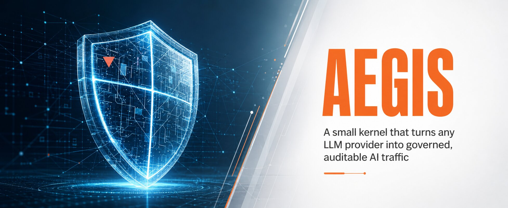
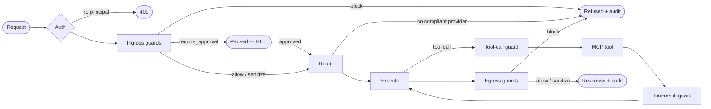

[](https://github.com/e-choness/aegis/actions/workflows/ci.yml)
[](https://github.com/e-choness/aegis/actions/workflows/docs.yml)
[](https://pypi.org/project/aegis-gateway/)
[](https://pypi.org/project/aegis-gateway/)
[](LICENSE)
[](https://github.com/astral-sh/ruff)

## What Aegis is

An open-source, plugin-first AI gateway framework. A small kernel plus seven
plugin contracts puts a governed, observable, provider-agnostic pipeline
between applications and LLM providers. Every flagship feature is built on the
same public contracts third-party developers use (the policy packs are the
permanent proof). Self-hosted, CLI-first, single-tenant-by-design at identity
level L2 (principal-aware, not multi-tenant).

**Features:**

- **Guardrail pipeline** — ingress, tool-call, tool-result, and egress stages;
  verdicts `allow / block / sanitize / require_approval`
- **Provider-agnostic** — OpenAI, Anthropic, Bedrock, Vertex, or any
  OpenAI-compatible endpoint; hot-swappable per route
- **Human-in-the-loop** — `require_approval` pauses execution via LangGraph
  `interrupt()`; resume via REST or CLI
- **Streaming** — true incremental streaming when all egress guards support
  `scan_chunk()`; buffered SSE otherwise; `policy lint` reports downgrades
- **Tool governance** — argument scan + masked-data exfiltration check on every
  tool call; prompt-injection scan on every tool result
- **Residency / data sovereignty** — declared region metadata + endpoint
  validation; fail-closed provider filtering; per-request audit
- **Observability** — Prometheus metrics, OpenTelemetry traces, Grafana
  dashboard included
- **Plugin-first** — seven contracts: `ModelProvider`, `Guardrail`,
  `VectorStoreProvider`, `EmbeddingProvider`, `SecretProvider`,
  `PipelineNode`, and `Authenticator` (shipped by `aegis-server`, not the core
  kernel)

## Architecture

```mermaid
flowchart TD
    subgraph IF[Interfaces]
        CLI[CLI · Typer + Rich]
        REST[REST API · native + OpenAI-compat]
        MCPS[MCP server]
        SDK[SDKs · Python + TypeScript]
    end
    AUTH[Auth middleware — Authenticator resolves Principal]
    subgraph PR[Pipeline runtime — LangGraph StateGraph]
        IN[Ingress guards] --> RX[Route + execute] --> EG[Egress guards]
    end
    subgraph K[Plugin kernel]
        REG[Plugin registry — entry points]
        CFG[Typed config + secret resolution]
        ASM[Per-route graph assembler]
        HK[Hooks + events — pluggy]
    end
    subgraph C[Seven plugin contracts]
        MP[ModelProvider] & GR[Guardrail] & VS[VectorStoreProvider]
        EB[EmbeddingProvider] & SP[SecretProvider]
        PN[PipelineNode] & AU[Authenticator (aegis-server)]
    end
    subgraph PP[Optional policy packs — public contracts only]
        CL[Classification] & RES[Residency] & BUD[Budgets] & PII[PII mask]
    end
    IF --> AUTH --> PR --> K --> C --> PP
```

## Quick start

**Five-minute path (no Docker):**

```bash
pip install aegis-gateway
aegis init          # writes aegis.yaml — PII masking enabled by default
aegis dev           # binds localhost:8000, no auth, FakeProvider
```

In a second terminal:

```bash
curl -s http://localhost:8000/v1/chat/completions \
  -H "Content-Type: application/json" \
  -d '{"model":"default","messages":[{"role":"user","content":"Hello!"}]}' \
  | python3 -m json.tool
```

**Point any OpenAI client at Aegis:**

```python
from openai import OpenAI

client = OpenAI(base_url="http://localhost:8000/v1", api_key="dev")
response = client.chat.completions.create(
    model="default",
    messages=[{"role": "user", "content": "Hello!"}],
)
print(response.choices[0].message.content)
```

## Request lifecycle



## Documentation

- [Full docs](https://e-choness.github.io/aegis/) — tutorials, how-to guides, reference, architecture
- [Plugin authoring guide](https://e-choness.github.io/aegis/tutorials/first-guardrail/) — write and publish a guardrail pack
- [CONTRIBUTING.md](docs/CONTRIBUTING.md) — development environment, gate policy, commit conventions
- [SECURITY.md](docs/SECURITY.md) — responsible disclosure process
- [LICENSE](LICENSE) — MIT license
- **Upgrading from v1?** See the
  [migration guide](https://e-choness.github.io/aegis/how-to/migrating-from-v1/). The v1
  codebase is preserved at the `v1-legacy` tag.
