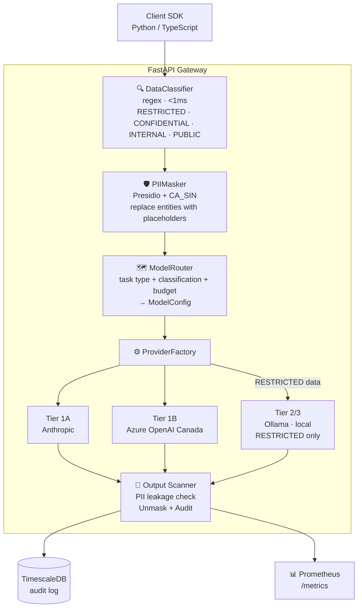

<div align="center">

# Aegis AI Gateway

**Enterprise AI governance · Provider-agnostic · Docker-native · PIPEDA compliant**

[](tests/)
[](docker-compose.yml)
[](pyproject.toml)
[](src/gateway/main.py)
[](LICENSE)
[](docs/architecture.md#pipeda-invariant)

[Quick Start](#quick-start) · [Architecture](#architecture) · [API Reference](docs/api.md) · [SDKs](#sdks) · [Observability](#observability) · [Docs](docs/)

</div>

---

Aegis is a centralized control plane for enterprise AI interactions. It transforms fragmented, ad-hoc LLM integrations into a governed, secure, and cost-optimized service layer.

**Provider-agnostic. Config-driven. Docker-native. No GPU required.**

---

## Why Aegis

- **One gateway** for all AI traffic — Anthropic, Azure OpenAI, Ollama, and beyond
- **Data classification in <1ms** — RESTRICTED data never reaches a cloud provider (code invariant, not config)
- **PII masking** before every request, unmasked in every response (Presidio + Canadian SIN)
- **Cost routing** — Haiku for simple tasks, Opus only when needed. Up to 88% cost reduction
- **Budget enforcement** — per-team monthly caps with pre-flight checks
- **Full observability** — Prometheus metrics, Grafana dashboards, TimescaleDB audit trail
- **RAG pipeline** — classification-aware retrieval via pgvector, 768-dim on-prem embeddings

---

## Quick Start

```bash
# 1. Copy and configure environment
cp .env.example .env
# Edit .env — set ANTHROPIC_API_KEY at minimum

# 2. Run all tests inside Docker (no host install required)
make test

# 3. Start the full stack
make up
```

| Service | URL | Credentials |
|---------|-----|-------------|
| Gateway API | http://localhost:8000 | — |
| API Docs (Swagger) | http://localhost:8000/docs | — |
| Prometheus | http://localhost:9090 | — |
| Grafana | http://localhost:3001 | admin / admin |

---

## Architecture



### Provider Tiers

| Tier | Provider | Classifications | Notes |
|------|----------|-----------------|-------|
| 1A | Anthropic | INTERNAL, PUBLIC | Primary cloud path |
| 1B | Azure OpenAI (Canada) | INTERNAL, PUBLIC | PIPEDA-safe fallback |
| 2/3 | Ollama (local) | **ALL** incl. RESTRICTED | Final fallback, user-configured |

**Circuit breaker:** 3 failures → circuit open → 60s half-open reset.

### Data Classifications

| Level | Triggers | Cloud Allowed |
|-------|----------|---------------|
| `PUBLIC` | No sensitive patterns detected | Yes |
| `INTERNAL` | Default for unclassified data | Yes |
| `CONFIDENTIAL` | API keys, bearer tokens, internal email, passwords | Yes |
| `RESTRICTED` | Canadian SIN, credit cards, account numbers | **Never** |

---

## PIPEDA Compliance

RESTRICTED data (Canadian SIN, credit cards, account numbers) **never leaves the local network**. This is enforced at four independent layers:

1. **Code invariant** in `ModelRouter.route()` — returns Ollama for RESTRICTED regardless of health state
2. **Prometheus counter** `restricted_data_cloud_violations_total` — must always be 0
3. **Database view** `restricted_cloud_violations` — query must always return 0 rows
4. **Test** `test_restricted_routing_invariant` — CI fails if invariant breaks

```bash
# Verify compliance at any time
curl http://localhost:8000/metrics | grep restricted
# restricted_data_cloud_violations_total 0 ✅
```

---

## Cost Routing

Smart model routing reduces AI spend by up to 88%:

| Task Type | Model | Rationale |
|-----------|-------|-----------|
| `commit_summary`, `simple_qa`, `routing` | Haiku | Fast, cheap, adequate |
| `pr_review`, `rag_response`, `code_explanation` | Sonnet | Balanced quality/cost |
| `security_audit`, `architecture_review` | Opus | Complex reasoning required |

**Budget-aware degradation:** Opus automatically downgrades to Sonnet when team budget drops below $1.00.

**Example savings** (500 devs × 20 calls/day):

| Routing | Monthly Cost |
|---------|-------------|
| All Opus (no routing) | $4,500 |
| Smart routing (70/25/5) | $555 |
| **Savings** | **88%** |

---

## RAG Pipeline

Classification-aware retrieval-augmented generation backed by pgvector.

```bash
# Index a document
curl -X POST http://localhost:8000/api/v1/rag/index \
  -H "Content-Type: application/json" \
  -d '{
    "document_id": "policy-v2",
    "content": "...",
    "data_classification": "INTERNAL",
    "namespace": "hr-policies"
  }'

# Query
curl -X POST http://localhost:8000/api/v1/rag/query \
  -H "Content-Type: application/json" \
  -d '{
    "question": "What is the remote work policy?",
    "namespace": "hr-policies",
    "top_k": 5
  }'
```

**Embedding routing:**

| Classification | Provider | Dimensions | Model |
|----------------|----------|------------|-------|
| RESTRICTED / CONFIDENTIAL | Ollama (local) | 768 | `nomic-embed-text` |
| INTERNAL / PUBLIC | Ollama (fallback) or OpenAI | 768 / 1536 | `nomic-embed-text` / `text-embedding-3-small` |

> Models are auto-pulled on first use — no manual `ollama pull` required.

---

## SDKs

### Python

```bash
pip install aegis-sdk  # or: pip install -e sdk/python
```

```python
from aegis_sdk import AIPlatformClient, InferenceRequest, PollOptions
import asyncio

async def main():
    async with AIPlatformClient(
        sso_token="your-token",
        base_url="http://localhost:8000"
    ) as client:
        job_id = await client.submit_inference(
            InferenceRequest(
                prompt="Review this diff for security issues",
                task_type="security_audit",
                team_id="platform",
                user_id="alice",
            )
        )
        result = await client.poll_job(job_id, PollOptions(timeout=90.0))
        print(result.result)

asyncio.run(main())
```

### TypeScript

```bash
npm install @aegis/ai-platform-client  # or: cd sdk/typescript && npm install
```

```typescript
import { AIPlatformClient } from "@aegis/ai-platform-client";

const client = new AIPlatformClient({
  ssoToken: "your-token",
  baseUrl: "http://localhost:8000",
});

const jobId = await client.submitInference({
  prompt: "Summarize this commit message",
  task_type: "commit_summary",
  team_id: "platform",
  user_id: "alice",
});

const result = await client.pollJob(jobId);
console.log(result.result);
```

---

## Observability

All metrics are exposed at `GET /metrics` in Prometheus text format.

| Metric | Type | Labels |
|--------|------|--------|
| `gateway_requests_total` | Counter | `team_id`, `model_alias`, `provider`, `tier`, `status` |
| `inference_cost_usd_total` | Counter | `team_id`, `model_alias`, `provider`, `tier` |
| `pii_detections_total` | Counter | `entity_type` |
| `restricted_data_cloud_violations_total` | Counter | _(must stay 0)_ |
| `gateway_inference_latency_seconds` | Histogram | `model_alias`, `provider` |
| `provider_health_up` | Gauge | `provider`, `tier` |
| `budget_utilization_ratio` | Gauge | `team_id` |

Grafana dashboards are pre-provisioned at startup. Open http://localhost:3001.

---

## Environment Variables

| Variable | Required | Default | Description |
|----------|----------|---------|-------------|
| `ANTHROPIC_API_KEY` | **Yes** | — | Tier 1A cloud provider |
| `AZURE_OPENAI_ENDPOINT` | No | — | Tier 1B; Azure disabled if unset |
| `AZURE_OPENAI_KEY` | No | — | Tier 1B API key |
| `OLLAMA_BASE_URL` | No | `http://localhost:11434` | Local LLM endpoint |
| `VECTORDB_URL` | No | — | PostgreSQL DSN for RAG; disables RAG if unset |
| `TIMESCALEDB_PASSWORD` | No | `aegis_dev` | Audit database password |
| `CORS_ORIGINS` | No | `""` | Comma-separated allowed origins |
| `GRAFANA_PASSWORD` | No | `admin` | Grafana admin password |

---

## Make Targets

```bash
make build    # Build all Docker images
make test     # Run 103 tests inside Docker (no host install)
make up       # Start gateway + TimescaleDB + Prometheus + Grafana
make down     # Stop all containers
make logs     # Tail gateway logs
make shell    # Interactive shell inside the gateway container
```

---

## Repository Layout

```
Aegis/
├── src/gateway/
│   ├── main.py                  # App lifecycle, middleware, router registration
│   ├── models.py                # Pydantic models (InferenceRequest, JobResult, …)
│   ├── api/v1/
│   │   ├── inference.py         # POST /inference · GET /jobs/{id}
│   │   ├── health.py            # GET /health
│   │   └── rag.py               # POST /rag/index · POST /rag/query
│   ├── providers/
│   │   ├── base.py              # LLMProvider ABC
│   │   ├── factory.py           # ProviderFactory.get(name)
│   │   ├── anthropic_provider.py
│   │   ├── azure_openai_provider.py
│   │   ├── ollama_provider.py
│   │   └── embeddings/          # EmbeddingProvider ABC + factory + implementations
│   └── services/
│       ├── classifier.py        # DataClassifier — regex, <1ms
│       ├── router.py            # ModelRouter — task/classification/budget → ModelConfig
│       ├── pii.py               # PIIMasker — Presidio + CA_SIN
│       ├── inference.py         # InferenceService — full pipeline orchestrator
│       ├── rag.py               # TextChunker + RAGService (pgvector)
│       ├── audit.py             # AuditLogger → TimescaleDB
│       ├── budget.py            # BudgetService — per-team monthly caps
│       └── health.py            # ProviderHealth — circuit breaker
├── config/
│   └── model_registry.yaml      # Single source of truth for model IDs and costs
├── scripts/
│   ├── init_db.sql              # TimescaleDB schema + audit hypertable
│   └── init_vectordb.sql        # pgvector schema (768-dim RAG index)
├── sdk/
│   ├── python/                  # aegis-sdk Python package
│   └── typescript/              # @aegis/ai-platform-client npm package
├── tests/                       # 103 pytest tests
├── evals/                       # Model evaluation framework
├── prometheus/                  # Scrape config
├── grafana/                     # Dashboard provisioning
├── docker-compose.yml
└── Makefile
```

---

## Performance

| Operation | p50 | p95 | p99 |
|-----------|-----|-----|-----|
| Data classification | 0.2ms | 0.5ms | 0.8ms |
| PII masking | 1.1ms | 2.3ms | 3.1ms |
| Routing | 0.1ms | 0.2ms | 0.3ms |
| **Total gateway overhead** | **1.4ms** | **3.0ms** | **4.2ms** |

| Config | Requests/sec |
|--------|-------------|
| 1 gateway (CPU) | 150 |
| 5 replicas | 750 |

---

## Scaling Path

**Demo → Production:** Add vLLM GPU tier to `docker-compose.yml` and restore `tier2_vllm` entries in `model_registry.yaml`. Zero code changes required — the router already supports it.

**Production → Enterprise:** Replicate gateway (K8s/Docker Swarm), add TimescaleDB read replicas and a global load balancer. Still zero application code changes.

---

## Docs

- [Architecture](docs/architecture.md) — design decisions, data flow, PIPEDA invariant, ADRs
- [API Reference](docs/api.md) — REST endpoints, request/response schemas, error codes
- [Development Guide](docs/development.md) — adding providers, running tests, extending evals

---

## License

MIT — see [LICENSE](LICENSE).
