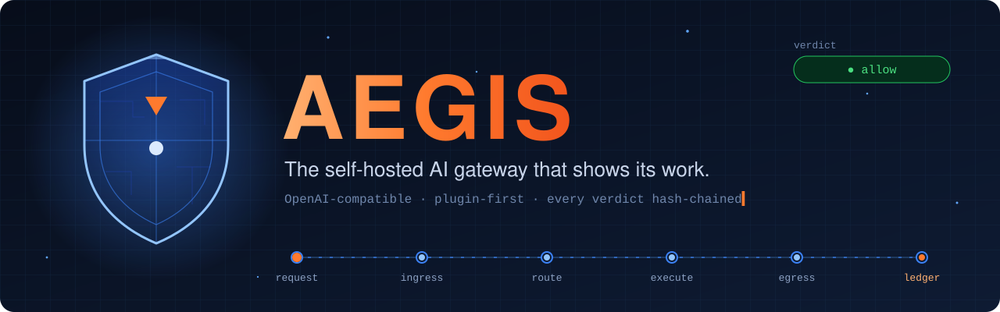
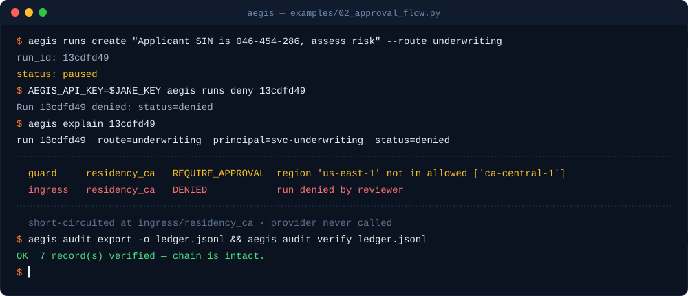

<div align="center">

<a href="https://e-choness.github.io/aegis/"></a>

[](https://github.com/e-choness/aegis/actions/workflows/ci.yml)
[](https://e-choness.github.io/aegis/)
[](https://pypi.org/project/aegis-gateway/)
[](https://pypi.org/project/aegis-gateway/)
[](LICENSE)
[](https://github.com/astral-sh/ruff)
[](https://github.com/e-choness/aegis/commits/main)

**Guardrails, human approvals and a tamper-evident audit trail between your apps and any LLM —<br>behind an OpenAI-compatible endpoint, configured in one YAML file.**

[**Documentation**](https://e-choness.github.io/aegis/) ·
[Quickstart](https://e-choness.github.io/aegis/guide/quickstart) ·
[Policy packs](https://e-choness.github.io/aegis/packs/) ·
[Write a plugin](https://e-choness.github.io/aegis/develop/plugins) ·
[Examples](examples/)

</div>

# Aegis

Aegis is a self-hosted AI gateway that shows you exactly why a request was
blocked, masked, or paused — and keeps a hash-chained record of every one of
those decisions. No enterprise tier required.

## See it work

A loan-underwriting request carrying a Canadian SIN is routed to a US-region
model. The residency guardrail doesn't block it outright — it **pauses for a
named reviewer**, who denies it. `aegis explain` shows why, and the exported
ledger verifies offline.

<p align="center">
  
</p>

Reproduce it with [`examples/scenarios/02_approval_flow.py`](examples/scenarios/02_approval_flow.py)
(the docstring has the two-command setup).

## Install

```bash
pip install aegis-gateway
aegis init                                 # writes aegis.yaml — PII masking on, fake provider
aegis serve --config aegis.yaml --no-auth  # :8000, zero credentials needed
```

Point any OpenAI client at it — the `model` field picks an Aegis route:

```python
from openai import OpenAI

client = OpenAI(base_url="http://localhost:8000/v1", api_key="dev")
response = client.chat.completions.create(
    model="default",
    messages=[{"role": "user", "content": "Email jane@example.com the summary"}],
)
print(response.choices[0].message.content)  # the model only ever saw <EMAIL_ADDRESS_0>
```

## The config that produces the scenario above

[`examples/fintech.yaml`](examples/fintech.yaml) — one route, two guardrails, zero code:

```yaml
providers:
  us_underwriting_llm:
    type: fake
    complete_response: "[underwriting] synthetic risk assessment — not a real model"
    residency:
      region: us-east-1

guardrails:
  pii:
    pack: aegis.pii
    mode: mask
  residency_ca:
    pack: aegis.residency
    region: us-east-1
    jurisdiction: US
    allowed_regions: [ca-central-1]
    require_approval: true   # pause for a human, don't auto-deny

pipeline:
  ingress: [pii, residency_ca]
  egress: [pii]

routes:
  underwriting:
    provider: us_underwriting_llm
    risk_rating: high
    review_interval_days: 180
    owner: risk-team@example.com
```

## `aegis explain` on the denied run

```text
run 13cdfd49  route=underwriting  principal=svc-underwriting  status=denied  config=sha256:8b01931ef…
────────────────────────────────────────────────────────────────────────
  guard         residency_ca              REQUIRE_APPROVAL  reason=residency: region 'us-east-1' for route 'underwriting' is not in the allowed set ['ca-central-1']
  ingress       residency_ca              DENIED  reason=run denied by reviewer
────────────────────────────────────────────────────────────────────────
  short-circuited at ingress/residency_ca · provider never called
```

The ledger's record of that denial names the reviewer —
`{"principal_id": "jane", "decision": "denied", "at": "2026-09-20T03:07:27Z"}` —
and `aegis audit export -o ledger.jsonl && aegis audit verify ledger.jsonl`
proves the hash-chained history is intact, offline, without trusting the
server that produced it.

## Four verdicts, nothing else

| | Verdict | What happens |
|:-:|---|---|
| 🟢 | **`allow`** | Continue unchanged. |
| 🔵 | **`sanitize`** | Continue with rewritten content. |
| 🔴 | **`block`** | Stop. The client gets a refusal, the ledger gets the reason. |
| 🟠 | **`require_approval`** | Checkpoint and pause until a named human approves or denies. |

Every verdict — including `allow` — is recorded, so *"which guard let this
through, and who signed off on the one that didn't?"* always has an answer.

## What's inside

| | |
|---|---|
| 🔌 **OpenAI-compatible API** | `/v1/chat/completions` with SSE streaming, plus a native `/v1/runs` API with approvers and background runs. |
| 🛡️ **Policy packs** | [PII masking](https://e-choness.github.io/aegis/packs/pii) · [residency](https://e-choness.github.io/aegis/packs/residency) · [classification](https://e-choness.github.io/aegis/packs/classification) · [budgets](https://e-choness.github.io/aegis/packs/budgets) · [LLM Guard](https://e-choness.github.io/aegis/packs/llm-guard) |
| ⏸️ **Human-in-the-loop** | Checkpointed pauses; resume from the CLI, REST, or the `/approvals` page. [→](https://e-choness.github.io/aegis/guide/approvals) |
| 🔗 **Evidence ledger** | Hash-chained route inventory and run evidence; `aegis audit export`/`verify`. [→](https://e-choness.github.io/aegis/guide/audit) |
| 🧩 **Plugin-first** | Packs are entry-point plugins on public contracts — no built-in special cases. [→](https://e-choness.github.io/aegis/develop/plugins) |
| 🧰 **Tooling** | `aegis` CLI, Python + TypeScript SDKs, OpenAPI spec, contract test kits. |

Aegis is **2.0.0a0 (alpha)**. The docs keep an honest
[status table](https://e-choness.github.io/aegis/guide/#where-things-stand)
of what's wired into `aegis serve` versus available as a Python API.

## Why this exists

Structured audit of model-provider decisions is a paid-tier feature on most
gateways. Here it's the default: every guardrail verdict is a hash-chained
ledger entry from the moment the server starts — not an add-on you upgrade
into once someone asks for evidence.

## Build on it

A guardrail is a class with a `scan()` method; a pack is a pip-installable
package. Scaffold one with contract tests already passing:

```bash
aegis plugin new my-guard --kind guardrail
aegis plugin test .tmp/aegis-guardrail-my-guard
```

Start with the [codebase tour](https://e-choness.github.io/aegis/develop/codebase).

## Documentation

- [**Docs site**](https://e-choness.github.io/aegis/) — guide, policy packs, developer docs, reference
- [Contributing](docs/CONTRIBUTING.md) · [Security policy](docs/SECURITY.md) · [Code of conduct](docs/CODE_OF_CONDUCT.md)
- [Changelog](CHANGELOG.md) · [MIT License](LICENSE)
