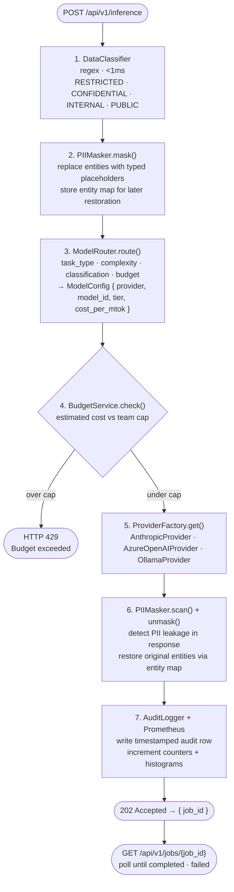
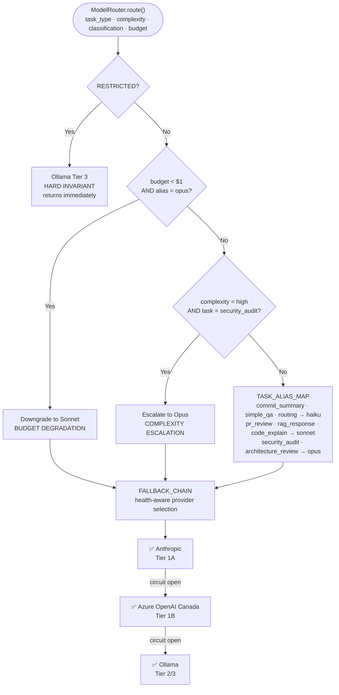
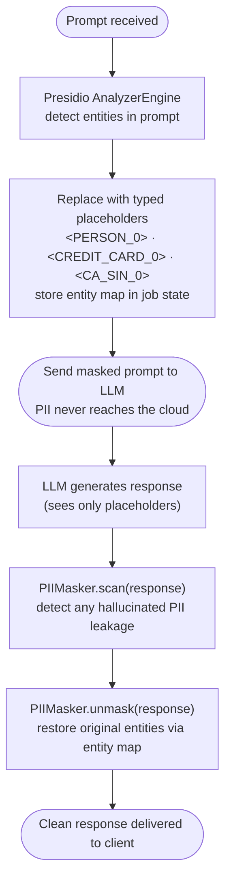
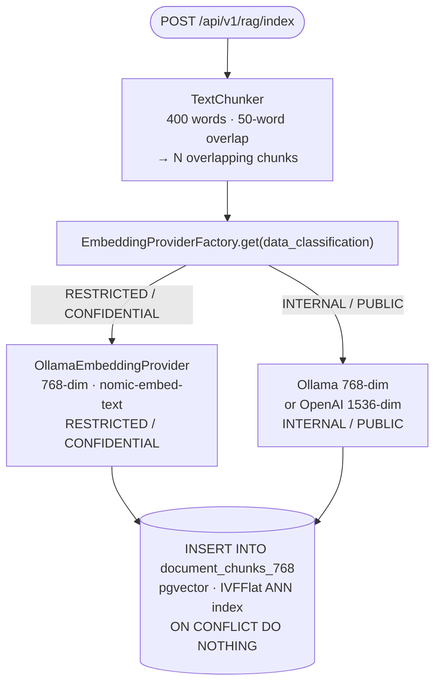
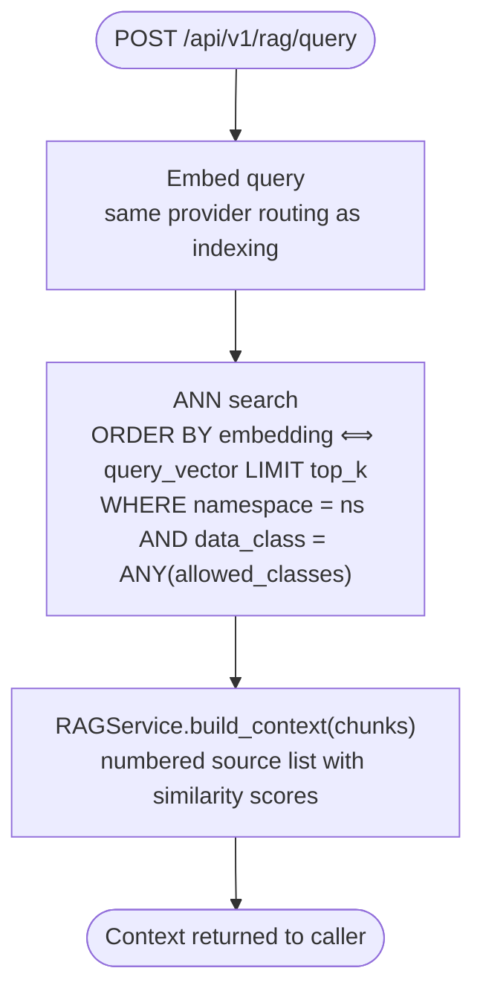
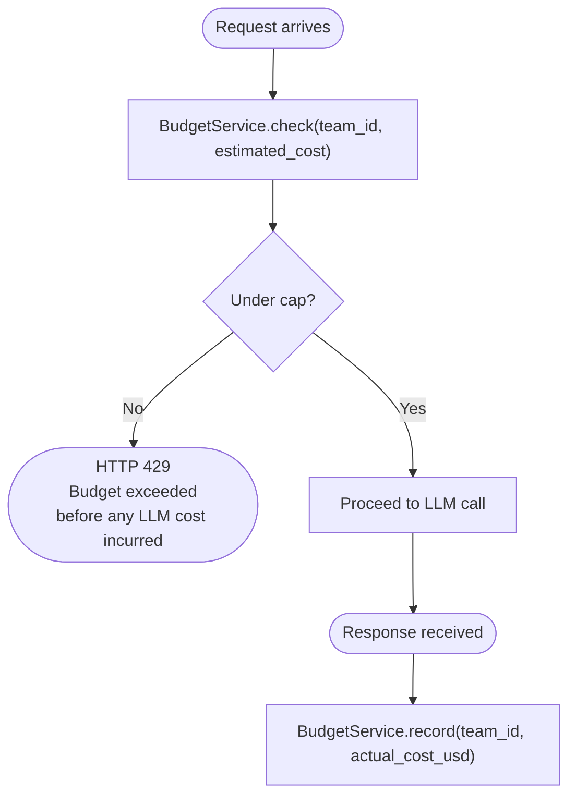
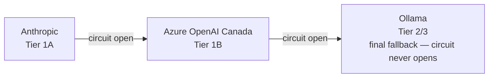
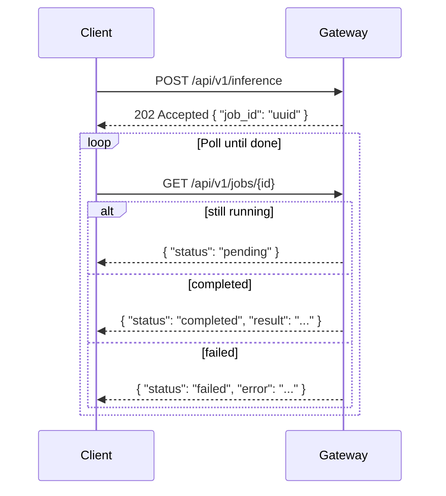

# Architecture

> Deep-dive on Aegis design decisions, data flow, and compliance invariants.

---

## Table of Contents

- [Design Goals](#design-goals)
- [Request Lifecycle](#request-lifecycle)
- [Data Classification](#data-classification)
- [Provider Tiers & Routing](#provider-tiers--routing)
- [PIPEDA Invariant](#pipeda-invariant)
- [PII Protection](#pii-protection)
- [RAG Pipeline](#rag-pipeline)
- [Observability](#observability)
- [Budget Enforcement](#budget-enforcement)
- [Circuit Breaker](#circuit-breaker)
- [Async Job Model](#async-job-model)
- [Config-Driven Model Registry](#config-driven-model-registry)
- [Scaling Path](#scaling-path)

---

## Design Goals

| Goal | Implementation |
|------|---------------|
| Provider-agnostic | `LLMProvider` ABC + `ProviderFactory` — swap providers via config, zero code changes |
| Zero cloud for RESTRICTED data | Hard routing invariant in `ModelRouter.route()`, tested, Prometheus-monitored |
| Sub-2ms governance overhead | Regex-only classification, rules-based routing — no ML in the hot path |
| Config-driven model selection | `config/model_registry.yaml` is the single source of truth for model IDs and costs |
| Auditable by design | Every inference writes a timestamped audit record to TimescaleDB |
| Solo-buildable | Docker Compose, CPU-only, no GPU required |

---

## Request Lifecycle



---

## Data Classification

`DataClassifier` uses compiled regex patterns. No ML in this path — zero latency variance, zero false negatives for known patterns.

| Level | Patterns | Examples |
|-------|----------|---------|
| `RESTRICTED` | Canadian SIN, credit cards, account numbers | `123-456-789`, `4111 1111 1111 1111` |
| `CONFIDENTIAL` | Internal email, API keys, bearer tokens, password assignments | `api_key=...`, `Bearer eyJ...` |
| `INTERNAL` | Default — no RESTRICTED or CONFIDENTIAL match | Most business prompts |
| `PUBLIC` | Explicitly set via `data_classification` request field | Documentation queries |

Classification applies to the **prompt only**. The LLM response is scanned separately for PII leakage.

---

## Provider Tiers & Routing

`ModelRouter` maps `(task_type, complexity, data_classification, budget_remaining_usd)` to a `ModelConfig`. All rules are explicit — no ML, fully deterministic.



**Model IDs are never hardcoded** in routing logic. `_build_config()` always looks up `config/model_registry.yaml`. Upgrading from `claude-sonnet-4-6` to a future version requires editing one YAML key.

---

## PIPEDA Invariant

RESTRICTED data must never be sent to a cloud provider. This is enforced at four independent layers.

### Layer 1 — Routing Code

```python
# src/gateway/services/router.py
if data_classification == DataClassification.RESTRICTED:
    return self._build_config("local", "ollama", "tier3_ollama", 3)
    # Returns immediately. No further routing logic runs.
```

### Layer 2 — Compliance Counter

```python
# src/gateway/services/inference.py
if result.data_class == "RESTRICTED" and result.tier == 1:
    restricted_violations_total.inc()  # Prometheus CRITICAL alert fires
```

### Layer 3 — Database View

```sql
-- scripts/init_db.sql
CREATE VIEW restricted_cloud_violations AS
  SELECT * FROM audit_log WHERE class = 'RESTRICTED' AND tier = 1;
-- Query must always return 0 rows
```

### Layer 4 — Automated Tests

```
test_restricted_routing_invariant
test_restricted_never_routes_to_openai
test_embedding_restricted_never_openai
```

CI fails if any invariant breaks.

```bash
# Verify live
curl http://localhost:8000/metrics | grep restricted
# restricted_data_cloud_violations_total 0  ✅
```

---

## PII Protection

`PIIMasker` wraps Microsoft Presidio with a custom recognizer for Canadian SIN numbers.

**Mask → Send → Unmask flow:**



**Supported entity types:** `PERSON`, `EMAIL_ADDRESS`, `PHONE_NUMBER`, `CREDIT_CARD`, `CA_SIN`, `IBAN_CODE`, `IP_ADDRESS`, `URL`

---

## RAG Pipeline





**Classification-aware retrieval:** a `PUBLIC` query cannot see `INTERNAL` or `RESTRICTED` chunks. `_allowed_classifications()` returns the set of levels ≤ the request's classification.

**Auto-pull:** `OllamaEmbeddingProvider` detects a "model not found" 404 and pulls `nomic-embed-text` automatically on first use (~274MB, one-time).

---

## Observability

### Prometheus Metrics

All metrics exposed at `GET /metrics` (Prometheus text format).

| Metric | Type | Key Labels |
|--------|------|-----------|
| `gateway_requests_total` | Counter | `team_id`, `model_alias`, `provider`, `tier`, `status` |
| `inference_cost_usd_total` | Counter | `team_id`, `model_alias`, `provider`, `tier` |
| `pii_detections_total` | Counter | `entity_type` |
| `restricted_data_cloud_violations_total` | Counter | _(must stay 0)_ |
| `gateway_inference_latency_seconds` | Histogram | `model_alias`, `provider` |
| `provider_health_up` | Gauge | `provider`, `tier` |
| `budget_utilization_ratio` | Gauge | `team_id` |

### Audit Log (TimescaleDB)

Every request appends a row to the `audit_log` hypertable (partitioned by `created_at`).

```sql
SELECT team_id, model_alias, provider, tier, data_class, cost_usd, latency_ms, created_at
FROM audit_log
WHERE created_at > NOW() - INTERVAL '1 hour';
```

### Grafana

Dashboards are pre-provisioned from `grafana/provisioning/`. Available at http://localhost:3001 after `make up`.

---

## Budget Enforcement

`BudgetService` tracks cumulative spend per team and enforces monthly caps with pre-flight checks before any LLM call is made.



The `budget_utilization_ratio` Prometheus gauge provides live visibility per team.

---

## Circuit Breaker

`ProviderHealth` tracks failures per provider.

| Setting | Value |
|---------|-------|
| Failure threshold | 3 consecutive failures |
| Circuit open duration | 60 seconds |
| Reset | Half-open (single probe after timeout) |

When a circuit opens, `ModelRouter._select_available_tier()` skips that provider and advances to the next in `FALLBACK_CHAIN`:



Ollama's circuit is never opened — it is always the final fallback.

---

## Async Job Model

Inference runs asynchronously. Clients receive a `job_id` immediately and poll until the job completes.



Both SDKs include `poll_job()` helpers with configurable timeout and exponential backoff.

---

## Config-Driven Model Registry

`config/model_registry.yaml` is the single source of truth for all model IDs and per-token costs. No model identifier appears in routing or provider logic.

```yaml
# config/model_registry.yaml
sonnet:
  tier1_anthropic: "claude-sonnet-4-6"
  tier1_azure:     "claude-sonnet-4-6"
  tier3_ollama:    "qwen2.5:0.5b"
  cost_input_per_mtok:  3.00
  cost_output_per_mtok: 15.00
  context_tokens:  1000000
```

**To upgrade a model:** change one YAML value, run `make build`. Zero code changes required anywhere else.

---

## Scaling Path

| Stage | Description | Code Changes |
|-------|-------------|-------------|
| **Demo** | Single Compose node, CPU, ~150 req/s | — |
| **Production** | Add vLLM GPU tier to Compose; restore `tier2_vllm` registry entries | 0 |
| **Enterprise** | K8s replicas, TimescaleDB read replicas, global LB | 0 |

Aegis is infrastructure-agnostic by design. All scaling is in the infrastructure layer.
