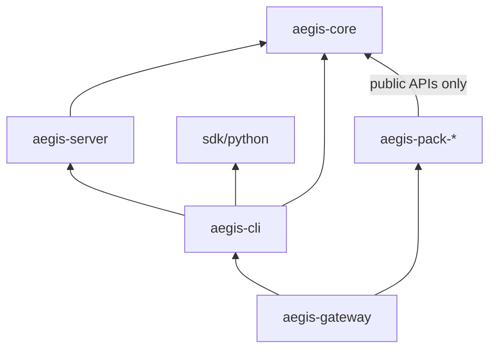

# Codebase tour

Aegis is a [uv workspace](https://docs.astral.sh/uv/concepts/projects/workspaces/)
of small packages. The rule that shapes everything: **the kernel knows
nothing about what the pipeline does.** It discovers plugins, validates
config, resolves secrets and compiles graphs; every opinion — which checks
run, how data is masked, where it may go — lives in a plugin.

## Repository map

```text
packages/
  aegis-core/            kernel: config, registry, pipeline, contracts, test kits
  aegis-server/          FastAPI app: auth, routes, run store, ledger, telemetry
  aegis-cli/             the `aegis` command (Typer + Rich)
  aegis-gateway/         umbrella package — depends on everything below
  aegis-pack-pii/        Presidio mask/unmask            → aegis.pii
  aegis-pack-residency/  region allow-list guard         → aegis.residency
  aegis-pack-classification/ regex labeller              → aegis.classification
  aegis-pack-budgets/    per-principal spend cap         → aegis.budgets
  aegis-pack-llm-guard/  LLM Guard scanner adapter       → aegis.llm_guard
  aegis-fixture-plugin/  test-only plugin for registry tests
sdk/
  python/                aegis-gateway-sdk (httpx; sync + async clients)
examples/                runnable scripts and example configs
tests/docs/              checks on README.md and every snippet in docs/
docs/                    this site (VitePress)
openapi.json             exported API spec (scripts/export_openapi.py)
```

PyPI names are prefixed `aegis-gateway-*` (`aegis-gateway-core`,
`aegis-gateway-pack-pii`, …); import names are `aegis_core`,
`aegis_pack_pii`, and so on.

## How the packages depend on each other



Packs may import only public `aegis_core` modules. `.importlinter` forbids
them from importing `aegis_server`, `aegis_cli`, `aegis_core.config`,
`aegis_core.secrets` and `aegis_core.registry`, and CI
runs `lint-imports`. Types a plugin factory needs (`GuardrailConfig`,
`PackNodes`, `ProviderConfig`, `ExporterConfig`) are re-exported from the public `aegis_core.packs` module for
exactly this reason. Heavy third-party libraries (LiteLLM, Presidio, LLM
Guard) are each imported in exactly one adapter module, so swapping or
upgrading one is a one-file change.

## Inside `aegis_core`

| Module | What lives there |
|---|---|
| `config/models.py` | Pydantic models for `aegis.yaml` (`AegisConfig`, `ProviderConfig`, `GuardrailConfig`, `PipelineConfig`, `RouteConfig`, `AuthConfig`). Unknown top-level keys are errors. |
| `config/loader.py` | `load_config(path)` — YAML → `secret://` resolution → `AEGIS__*` env overrides → validation. |
| `config/build.py` | `build_executor(cfg)` — calls each pack's factory, builds providers (built-in or `aegis.providers` plugins), compiles one pipeline per route; refuses stages it can't enforce. `build_exporters(cfg)`, `config_digest(cfg)`. |
| `registry/` | `PluginRegistry` — entry-point discovery across the `aegis.*` groups. |
| `pipeline/state.py` | `RunState`, `RunStateDelta`, `RunEvent`. |
| `pipeline/verdict.py` | `Verdict` and its four constructors. |
| `pipeline/assembler.py` | `PipelineAssembler.compile()` → LangGraph `StateGraph`; stream-capability negotiation. |
| `pipeline/executor.py` | `PipelineExecutor` — route → compiled pipeline; `run()` and `resume()`. |
| `pipeline/checkpointer.py` | SQLite and Postgres checkpointers for paused runs. |
| `guardrails/` | `Guardrail` and `IncrementalGuardrail` protocols; `GuardNode` (the verdict spine). |
| `providers/` | `ModelProvider` protocol; `LiteLLMProvider`, `OpenAICompatibleProvider`. |
| `mcp/` | Tool-call/tool-result guard protocols, `McpExecuteNode`, shipped tool guards. |
| `rag/` | `VectorStoreProvider`, `EmbeddingProvider`, `RetrievalNode`, Chroma/pgvector stores. |
| `secrets/` | `SecretRef`, `SecretResolver`, `env` and `keyring` backends. |
| `exporters/` | `Exporter` protocol — where evidence-ledger records are forwarded. |
| `packs.py` | Public API for plugin factories: `GuardrailConfig`, `ProviderConfig`, `ExporterConfig`, `PackNodes`, `PackFactory`. |
| `testing/` | Contract kits and fakes for plugin authors. |
| `errors.py` | Every `AEG-*` error class. |

## A request, through the code

1. **`aegis serve`** (`aegis_cli/commands/serve.py`) loads the config,
   builds the executor with a SQLite checkpointer, and calls
   `aegis_server.app.create_app()`.
2. **`create_app()`** installs `AuthMiddleware`, mounts the routers and
   `/metrics`, and on startup writes one `model_inventory` ledger record
   per route.
3. **`AuthMiddleware`** resolves the bearer key to a `Principal` via the
   `ApiKeyAuthenticator` (or `NoneAuthenticator` with `--no-auth`).
4. **`routes/runs.py` / `routes/chat.py`** build a `RunState` and call the
   route's compiled pipeline inside `telemetry.run_span()` (OTel span +
   Prometheus metrics).
5. **The compiled graph** runs ingress nodes → execute → egress nodes.
   `GuardNode` turns guardrail verdicts into events and `blocked` / `paused`
   statuses; a pause raises a LangGraph interrupt and checkpoints.
6. **Back in the route**, the run record goes to the run store and a
   `run_evidence` record is appended to the ledger
   (`store/ledger.py`).
7. **`routes/hitl.py`** handles `resume`: checks approvers, calls
   `executor.resume()`, and appends a second `run_evidence` with the
   approver.

## Where to make a change

| You want to… | Go to |
|---|---|
| Add a check or transformation | A new pack — see [Write a plugin](./plugins). Don't touch core. |
| Add an `aegis.yaml` field | `config/models.py`, then the consumer; add a docs example (it's validated by `tests/docs`). |
| Add a REST endpoint | `aegis_server/routes/`, include it in `app.py`, re-export `openapi.json`, update both SDKs. |
| Add a CLI command | `aegis_cli/commands/`, register it in `main.py`. |
| Add an error | Subclass in `errors.py` with `code`, `what`, `why`, `fix`; add it to the [error reference](/reference/errors). |
| Wire `tool_call` / `tool_result` from YAML | `config/build.py` (`UNWIRED_STAGES`, `_check_unwired_stages`) — the config is parsed and linted; it needs an MCP-session config to hang off. |

## Conventions

- **Protocols, not base classes.** Contracts are `typing.Protocol`s marked
  `runtime_checkable`; plugins never inherit from Aegis classes.
- **Async everywhere** on the request path.
- **Secrets are `SecretStr`** from load to use; never log or `repr` them.
- **Errors are `AEG-<AREA>-<NNN>`** with what/why/fix.
- **Nothing on the request path makes real network calls in tests** — use
  `FakeProvider` and the contract kits.
