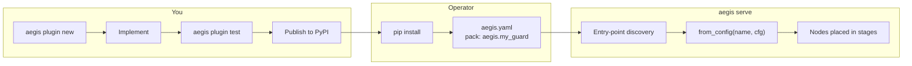

# Write a plugin

A plugin is an ordinary Python package that declares
[entry points](https://packaging.python.org/en/latest/specifications/entry-points/).
`pip install` it and Aegis finds it — no registry to submit to, no core code
to patch. The first-party packs are built exactly this way.

## The lifecycle



## Entry-point groups

| Group | Contract | How it's used today |
|---|---|---|
| `aegis.packs` | `from_config(name, cfg) -> dict[str, list[PipelineNode]]` | **Loaded by `aegis serve`** for every `pack:` in `aegis.yaml`. This is the group that makes a plugin usable from config. |
| `aegis.guardrails` | `Guardrail` | Discovery and conformance (`aegis plugin list/info/test`). Wrap in a `GuardNode` from your pack factory. |
| `aegis.nodes` | `PipelineNode` | Discovery and conformance. Return from your pack factory. |
| `aegis.providers` | `ModelProvider` | Discovery and conformance. Register on an executor from Python — `aegis.yaml` builds only `fake`, `anthropic` and `openai_compatible` so far. |
| `aegis.exporters` | `Exporter` | Discovery and conformance; no runtime consumer yet. |
| `aegis.secrets` | `SecretProvider` | Register with a `SecretResolver` when loading config yourself. |

## 1. Scaffold

```bash
aegis plugin new my-guard --kind guardrail   # or: node | provider | exporter
```

This writes `.tmp/aegis-guardrail-my-guard/` (change with `--output-dir`):

```text
aegis-guardrail-my-guard/
  pyproject.toml                 entry points already declared
  conftest.py  pytest.ini
  src/aegis_guardrail_my_guard/
    __init__.py
    guard.py                     MyGuard — a stub that always allows
    factory.py                   from_config → {"ingress": [GuardNode([MyGuard()])]}
  tests/
    test_contract.py             GuardrailContractKit — passes unedited
    test_factory.py              from_config round-trip
```

## 2. Implement

A guardrail is any class with a `name`, a `streaming` class attribute, and
an async `scan(state) -> Verdict`:

```python
import re
from typing import ClassVar, Literal

from aegis_core.pipeline.state import RunState
from aegis_core.pipeline.verdict import Verdict

_TICKET = re.compile(r"\bINC-\d{6}\b")


class MyGuard:
    """Blocks requests that paste internal incident ticket numbers."""

    name: str = "my_guard"
    streaming: ClassVar[Literal["none", "incremental"]] = "none"

    async def scan(self, state: RunState) -> Verdict:
        text = state.messages[-1].content if state.messages else ""
        if _TICKET.search(text):
            return Verdict.block("internal ticket numbers must not leave the company")
        return Verdict.allow()
```

The factory decides which stage the guard runs in and reads any options
from the YAML entry (extra keys are allowed on `GuardrailConfig`):

```python
from aegis_guardrail_my_guard.guard import MyGuard

from aegis_core.config.models import GuardrailConfig
from aegis_core.guardrails.spine import GuardNode
from aegis_core.pipeline.protocol import PipelineNode


def from_config(name: str, cfg: GuardrailConfig) -> dict[str, list[PipelineNode]]:
    guard = MyGuard()
    guard.name = name
    return {"ingress": [GuardNode([guard], name=name)]}
```

`streaming` is not decorative: one `"none"` guard on egress makes the whole
route buffer. Implement `scan_chunk()` and `finalize()` and declare
`"incremental"` to keep true streaming — see [Streaming](/guide/streaming).

### Writing a node instead

Use a node when you need to **transform** state rather than decide.
Return only what you change; emit a `verdict` event if it should appear in
`aegis explain` and the ledger:

```python
from dataclasses import dataclass

from aegis_core.pipeline.state import RunEvent, RunState, RunStateDelta
from aegis_core.providers.models import Message


@dataclass
class StripSignatures:
    name: str = "strip_signatures"

    async def run(self, state: RunState) -> RunStateDelta:
        cleaned = [
            Message(role=m.role, content=m.content.split("\n-- \n")[0])
            for m in state.messages
        ]
        event = RunEvent(
            stage="ingress",
            node=self.name,
            event_type="verdict",
            data={"verdict": "sanitize", "reason": "email signatures removed"},
        )
        return RunStateDelta(messages=cleaned, events=[event])
```

## 3. Test

```bash
aegis plugin test .tmp/aegis-guardrail-my-guard
```

This runs the package's own tests, **then an independent conformance check
the CLI performs itself** — so it still catches problems if you've edited
the generated tests. It verifies the class satisfies its protocol (a
missing `streaming` class attribute is the classic failure) and, for
guardrails and nodes, that `from_config` returns real `PipelineNode`s and
doesn't leak `mask_map` or `messages` into event data.

More on the kits in [Testing](./testing).

## 4. Publish and use

```toml
[project]
name = "aegis-guardrail-my-guard"
dependencies = ["aegis-gateway-core>=2.0.0a0"]

[project.entry-points."aegis.guardrails"]
my_guard = "aegis_guardrail_my_guard:MyGuard"

[project.entry-points."aegis.packs"]
"aegis.my_guard" = "aegis_guardrail_my_guard.factory:from_config"
```

```yaml
guardrails:
  tickets:
    pack: aegis.my_guard

pipeline:
  ingress: [tickets]
```

Name packages `aegis-<kind>-<name>` so they're easy to find. Pack names
must be unique across installed packages — a duplicate raises
`AEG-CFG-021` at startup.

## Providers

A provider implements `complete`, `stream`, `embed` and `info`
(`aegis_core.providers.ModelProvider`). `aegis plugin new --kind provider`
generates a working stub. Until `aegis.yaml` can build plugin providers,
register yours on an executor directly:

```python
from aegis_core.pipeline import PipelineExecutor


def register(executor: PipelineExecutor, provider, ingress, egress) -> None:
    executor.register("custom", provider=provider, ingress=ingress, egress=egress)
```

Often you don't need one at all: any OpenAI-compatible server (vLLM,
Ollama, LM Studio, Azure OpenAI…) works with `type: openai_compatible`.

## Secret backends

```python
from pydantic import SecretStr

from aegis_core.secrets import SecretRef


class VaultBackend:
    scheme = "vault"

    def resolve(self, ref: SecretRef) -> SecretStr:
        # ref.path = "prod/llm", ref.key = "anthropic" for secret://vault/prod/llm#anthropic
        value = read_from_vault(ref.path, ref.key)  # noqa: F821 — your client
        return SecretStr(value)
```

Register it with `SecretResolver.register()` and pass the resolver to
`load_config(path, resolver=...)`. Raise `AegisSecretRefError` when a
secret is missing so the error carries a proper `AEG-CFG-010` code.
