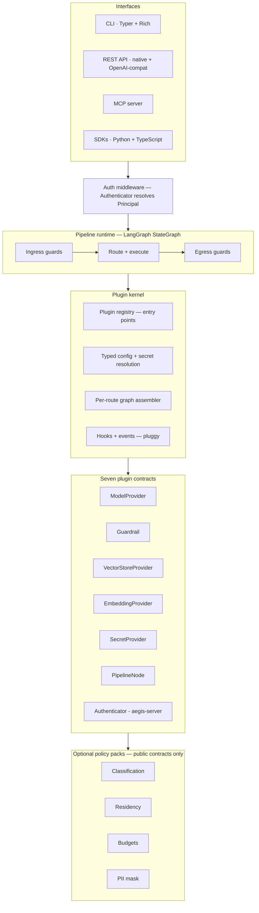

# Architecture: a kernel and seven contracts

Aegis v2 is built on one structural bet: **the kernel knows nothing about what
the pipeline does.** It knows how to discover plugins, validate typed
configuration, resolve secrets, and compile a request pipeline into a graph.
Everything with an opinion — which providers exist, what the guardrails check,
where vectors live, how credentials resolve, who a request belongs to — is a
plugin implementing one of seven published contracts:

| Contract | Job |
|---|---|
| `ModelProvider` | complete / stream / embed against any model backend |
| `Guardrail` | scan content, return a verdict |
| `VectorStoreProvider` | RAG storage |
| `EmbeddingProvider` | RAG embedding |
| `SecretProvider` | resolve `secret://` references at config load |
| `PipelineNode` | arbitrary middleware in the request graph |
| `Authenticator` | resolve request credentials into a `Principal` (shipped by aegis-server) |

Discovery uses Python entry points — the pytest/Flake8 model. A third-party
package declares an entry point in its `pyproject.toml` and Aegis finds it at
startup with zero core changes. Boring, standard, and proven at ecosystem
scale.

## Why the pipeline is a graph

The request lifecycle is a LangGraph `StateGraph`, not a call chain. That
choice buys four things at once: conditional routing (compliance rules become
auditable graph edges, not buried `if` statements), checkpointing (runs
survive restarts), human-in-the-loop interrupts (a guardrail can *pause* a
request instead of only blocking it), and streaming. It also collapses two
concepts into one: a gateway request and an agent run are the same abstraction,
so agentic workloads are additional nodes, not a second system.

## Policy packs are the proof

Every governance feature Aegis ships — data classification, residency,
budgets, PII masking — is an optional policy pack built **only** on the public
contracts, enforced by an import-linter rule in CI. If a flagship feature
cannot be built on the public interface, the interface is wrong. The packs are
the permanent, executable proof that it isn't.

## What this is not

Single-tenant by design (principal-aware, not multi-tenant — see
[identity levels](identity-levels.md)). No bundled local inference: the
provider contract leaves the slot open. No baked-in observability stack:
OpenTelemetry at the core, exporters as plugins. Built *on* LangGraph, not
competing with it.
