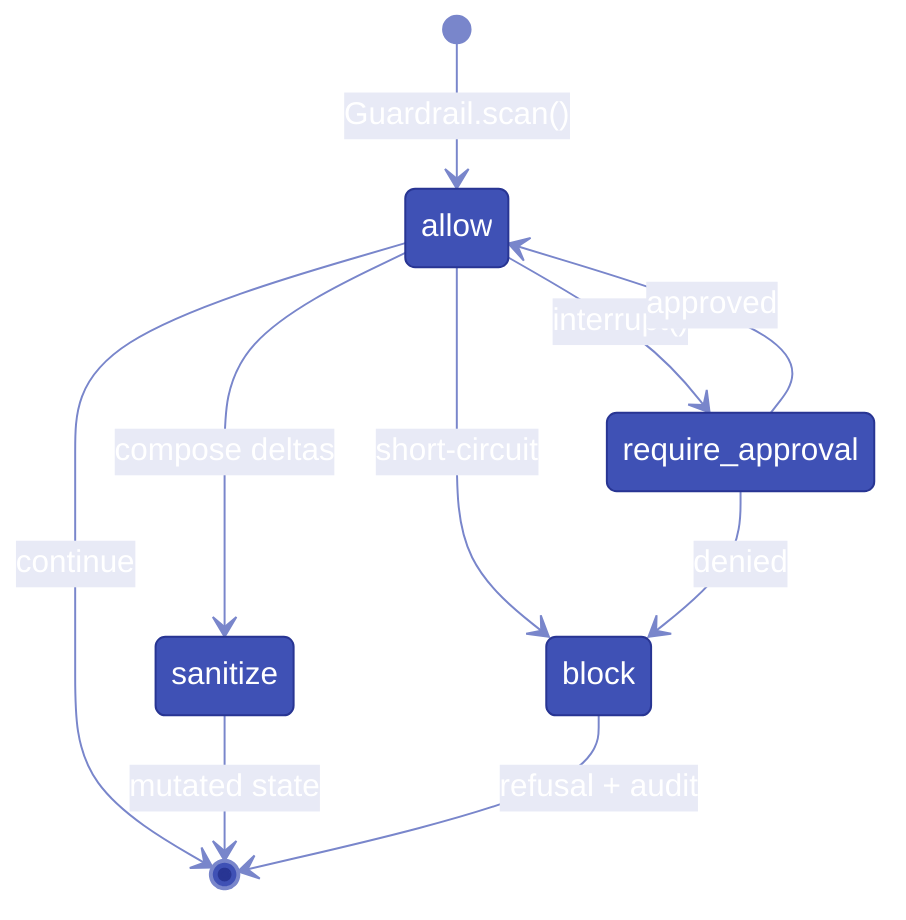

# Design decisions (D1–D18)

The following decisions are frozen in [`PROJECT_SPEC.md`](https://github.com/e-choness/aegis/blob/main/PROJECT_SPEC.md).
They are reproduced here for documentation purposes. The spec file is the authoritative source.

*Verdict state machine — every guard returns exactly one verdict; block and require_approval are terminal for the stage.*

## D1 — Kernel

Plugin registry (importlib.metadata entry points), typed config + secret URI resolution, per-route graph assembler, hooks/events on pluggy (zero transitive deps). Kernel knows nothing about what the pipeline does.

## D2 — Pipeline

LangGraph `StateGraph` over typed `RunState`. Staged spine (ingress → route → execute → egress → finalize) configured via ordered node lists in YAML; code-level escape hatch accepts a fully custom compiled `StateGraph`. One graph compiled per route profile at startup; recompiled on config reload.

## D3 — Seven contracts

ModelProvider, Guardrail, VectorStoreProvider+EmbeddingProvider, SecretProvider, PipelineNode, Authenticator (aegis-server).

## D4 — Policy packs on public contracts

All governance ships as optional policy packs built only on public contracts. An import-linter rule enforces zero private-API usage by packs.

## D5 — Providers

Own `ModelProvider` Protocol; default implementation wraps LiteLLM (library mode, imported in exactly one module). Saved provider profiles (named types + generic `openai_compatible` with base_url/api_key/model). Hot-swappable per request/route/CLI. Local-model provider slot defined but not implemented in v1.

## D6 — Guardrails

Verdicts `allow / block / sanitize / require_approval`; capability `streaming: none | incremental` (incremental ⇒ `scan_chunk()` + `finalize()`). LLM Guard is the default adapter (wrapped, optional extra). Fast-path regex + Presidio guards live in Aegis's own packs, independent of LLM Guard's release cadence.

## D7 — Residency

Declared `residency: {region, jurisdiction, source_url}` metadata on provider profiles; endpoint-encoded region validation at lint time (Azure/Bedrock/Vertex/OpenAI-region URLs); fail-closed route filtering (unknown region = non-compliant); advisory-only runtime geolocation telemetry; per-request region audit.

## D8 — Secrets

`SecretProvider` resolves `secret://<backend>/<path>#<key>` URIs at config load; resolved values never persisted. Defaults: env/.env, then OS keychain via `keyring` for CLI profiles. Vault/AWS/GCP/Azure are plugin adapters. All credentials typed `SecretStr`.

## D9 — Serving

FastAPI + uvicorn. Native `/v1/runs` API and OpenAI-compatible `/v1/chat/completions`. LangServe rejected (deprecated, archived).

## D10 — SDKs

First-party Python + TypeScript only. Published versioned OpenAPI spec + in-repo openapi-generator config for community languages. OpenAI compatibility is the universal multi-language path. Native streaming wire format mirrors OpenAI SSE.

## D11 — HITL

`require_approval` → LangGraph `interrupt()`. Checkpointer mandatory: SQLite (dev) / Postgres (prod) via LangGraph's `BaseCheckpointSaver` interface. Resume: `POST /v1/runs/{id}/resume` and `aegis runs approve|deny`.

## D12 — Streaming

Per-route capability negotiation computed at compile time — all egress guards incremental ⇒ true streaming with hold-back window (token/sentence) + mandatory `finalize()` pass (late violation ⇒ truncate stream + violation event); any non-incremental guard ⇒ buffered route. Buffered routes still answer `stream: true` with OpenAI-format SSE after scanning. `policy lint` reports every streaming downgrade.

## D13 — Tool governance

Execute stage is a subgraph. Tool calls pass a tool-call guard (argument scan, masked-data exfiltration check, per-tool `require_approval`); tool results pass a tool-result guard (prompt-injection scan). RAG-retrieved content flows through the tool-result chain. Per-tool policy in YAML.

## D14 — Execution modes

Synchronous + SSE is the default. `background: true` creates durable runs (checkpointer-backed) with `GET /v1/runs/{id}` polling. Pending approvals are background runs in `pending` state.

## D15 — Persistence

Plain Postgres default (SQLite for dev), SQLAlchemy 2 + Alembic. Timescale optional, documented drop-in. pgvector and LangGraph checkpoints co-locate on the same instance.

## D16 — Distribution

Tiered extras — `aegis-gateway` (slim), `[pii]`, `[llm-guard]`, `[rag]`, `[all]` — mapping one-to-one onto packs. Observability (Prometheus/Grafana) is an opt-in compose profile over an OpenTelemetry core.

## D17 — Identity (L2)

`Authenticator` contract resolves credentials → `Principal{id, team, labels}`. Default impls: `none` (dev) and `api_key` (Aegis-issued virtual keys, SHA-256 hashed, `Authorization: Bearer aeg-...`, managed via `aegis keys create|list|revoke`; plaintext shown once). Auth runs as FastAPI middleware before the graph. Policy-per-principal via existing packs (budgets per team, allowed routes per key, residency per principal label). `runs approve` checks approver principal against an `approvers:` policy. `aegis serve` refuses to start without an authenticator unless `--no-auth` is explicit; `aegis dev` binds localhost with auth off. L3 multi-tenancy is explicitly out of scope; seams left: `Principal.labels`, RAG namespaces, per-principal policy.

## D18 — DX

`aegis init` ships PII pack enabled, everything else present-but-commented. `aegis.testing` contract test kits ship with each contract. Community naming: `aegis-<kind>-<name>` (guardrail/provider/secrets/...). Docs: mkdocs-material + mkdocstrings, Diátaxis structure, every snippet CI-tested. Error format: `AEG-<AREA>-<NNN>` + what/why/fix(+docs link).
