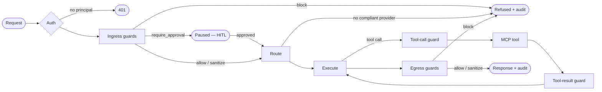

# The pipeline and the verdict model

Every request flows through a staged spine — ingress guards → route → execute
→ egress guards → finalize — compiled per route at startup from ordered node
lists in `aegis.yaml`. A code-level escape hatch accepts a fully custom
`StateGraph` for the cases configuration cannot express.

## RunState: the contract between nodes

Nodes communicate only through a typed `RunState`: run id, `Principal`,
messages, free-form `labels` (how packs talk without importing each other —
the classifier writes `labels.classification`, the residency pack reads it),
the mask map (a channel never serialized into model-visible messages), the
selected route, an append-only event log, and usage/cost accumulators. A
third-party node and a built-in node are indistinguishable to the runtime.

## Four verdicts

Every guard returns exactly one of:

- **allow** — continue unchanged.
- **sanitize** — continue with mutated state (e.g. masked text). Sanitize
  deltas compose in configured order.
- **block** — terminal. The stage short-circuits; the client gets a refusal;
  the audit log gets the reason.
- **require_approval** — the run checkpoints and pauses via a LangGraph
  interrupt; a human resumes it with allow or block. Approval authority is
  itself policy: the approver's `Principal` is checked against `approvers:`.

Every verdict — including `allow` — is an audit event. "Which guard let this
through?" is always answerable.

## Tool traffic is governed in both directions

A tool call is model *output* (it can exfiltrate masked data or take a
dangerous action) and a tool result is untrusted *input* (the prime
prompt-injection vector). So the execute stage splices the same guardrail
contract into both directions: a tool-call guard (argument scan, exfiltration
check, per-tool approval) and a tool-result guard (injection scan).
RAG-retrieved content is untrusted for the same reason and flows through the
same tool-result chain.
