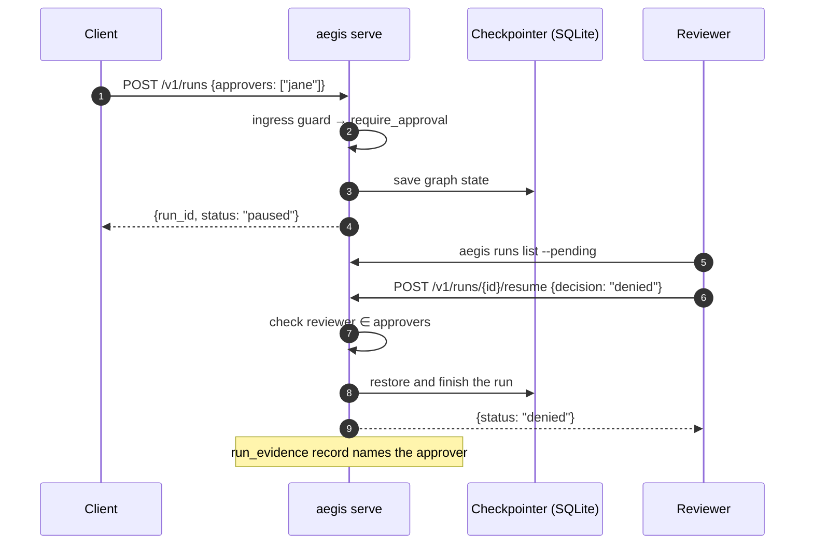

# Human approvals

A guardrail that returns `Verdict.require_approval(prompt)` doesn't refuse the
request — it **checkpoints the run and pauses it** until a human decides. The
decision, and who made it, is recorded in the ledger.



## Make a guardrail pause

The residency pack can pause instead of block — this is the configuration
behind the demo on the home page:

```yaml
providers:
  us_underwriting_llm:
    type: fake
    residency:
      region: us-east-1

guardrails:
  residency_ca:
    pack: aegis.residency
    region: us-east-1
    jurisdiction: US
    allowed_regions: [ca-central-1]
    require_approval: true

pipeline:
  ingress: [residency_ca]

routes:
  underwriting:
    provider: us_underwriting_llm
```

In your own guardrail it is one line:

```python
from aegis_core.pipeline.state import RunState
from aegis_core.pipeline.verdict import Verdict


class LargeTransferGuard:
    name = "large_transfer"
    streaming = "none"

    async def scan(self, state: RunState) -> Verdict:
        if "wire transfer" in state.messages[-1].content.lower():
            return Verdict.require_approval("Wire transfers need a second pair of eyes")
        return Verdict.allow()
```

## Checkpointing

`aegis serve` always runs with a SQLite checkpointer
(`--checkpoint-db`, default `./aegis_checkpoints.db`), so paused runs survive
a restart of the process as long as the file does. When embedding the server
yourself, `aegis_core.pipeline.checkpointer` also provides a Postgres-backed
checkpointer.

## Say who may decide

Pass an approver list when the run is created. An empty list means any
authenticated principal may decide.

::: code-group

```bash [CLI]
aegis runs create "Wire $40k to vendor 7731" --route payments --approver jane --approver sam
```

```bash [REST]
curl -X POST http://localhost:8000/v1/runs \
  -H "Authorization: Bearer $AEGIS_API_KEY" \
  -H "Content-Type: application/json" \
  -d '{"route": "payments", "approvers": ["jane", "sam"],
       "messages": [{"role": "user", "content": "Wire $40k to vendor 7731"}]}'
```

```python [Python SDK]
from aegis_sdk import AegisClient

with AegisClient(base_url="http://localhost:8000", api_key="aeg-...") as client:
    run = client.create_run(
        [{"role": "user", "content": "Wire $40k to vendor 7731"}],
        route="payments",
        approvers=["jane", "sam"],
    )
    print(run.run_id, run.status)
```

:::

A resume from anyone else is rejected with **403 `AEG-AUTH-003`**; resuming
a run that isn't paused returns **409**.

## Decide

::: code-group

```bash [CLI]
aegis runs list --pending
aegis runs show <run-id>
aegis runs approve <run-id>     # or: aegis runs deny <run-id>
```

```bash [REST]
curl -X POST http://localhost:8000/v1/runs/<run-id>/resume \
  -H "Authorization: Bearer $AEGIS_API_KEY" \
  -H "Content-Type: application/json" \
  -d '{"decision": "approved"}'      # or "denied"
```

:::

There is also a small web page at **`/approvals`** listing paused runs with
approve and deny buttons.

## Afterwards

`aegis explain <run-id>` shows the pause and the decision side by side, and
the run's `run_evidence` record in the ledger carries the approver's principal
id and timestamp. See [Audit & evidence ledger](./audit).
