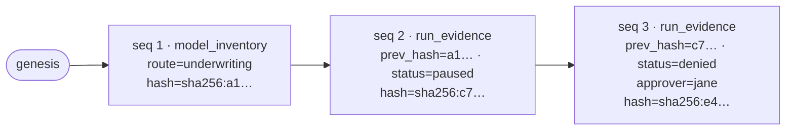

# Audit & evidence ledger

Aegis keeps two records of what happened:

| Store | What's in it | Lifetime | Read it with |
|---|---|---|---|
| **Run store** | Every run: status, principal, route, approvers, full event log | In memory — cleared on restart | `aegis explain`, `aegis runs`, `GET /v1/audit`, `GET /v1/runs/{id}` |
| **Evidence ledger** | Hash-chained `model_inventory` and `run_evidence` records | SQLite file (`--ledger-db`, default `./aegis_ledger.db`) | `aegis audit`, `aegis report`, `GET /v1/audit/ledger` |

The run store is for operating the gateway; the ledger is the durable,
tamper-evident record you hand to someone else.

## Explain a run

```bash
export AEGIS_SERVER_URL=http://localhost:8000 AEGIS_API_KEY=aeg-...
aegis explain <run-id>      # or: aegis explain --last
```

```text
run 13cdfd49  route=underwriting  principal=svc-underwriting  status=denied  config=sha256:8b01931ef…
────────────────────────────────────────────────────────────────────────
  guard         residency_ca              REQUIRE_APPROVAL  reason=residency: region 'us-east-1' for route 'underwriting' is not in the allowed set ['ca-central-1']
  ingress       residency_ca              DENIED  reason=run denied by reviewer
────────────────────────────────────────────────────────────────────────
  short-circuited at ingress/residency_ca · provider never called
```

One row per verdict event, coloured by kind. `--json` prints the raw events.

## The ledger

Every record carries a sequence number, the previous record's hash and its
own hash — `sha256` over the canonical JSON (sorted keys, no whitespace) of
everything except `hash`. The first record's `prev_hash` is `"genesis"`.



Change any byte of any record and every later hash stops matching.

### Record types

**`model_inventory`** — written for each route every time the server starts.
It captures the route (`model_id`), its `owner`, `risk_rating` and next review
date (from `review_interval_days`), and the **config digest** — a SHA-256 of
the whole `aegis.yaml` with secrets redacted — as `model_version`.

**`run_evidence`** — written when a run finishes or is resumed: run id,
route, principal, timestamps, status, the config digest in force, the verdict
events, and for approvals `approver: {principal_id, decision, at}`.
`mask_map` and raw `messages` are stripped from events before they are
written, so masked PII never reaches the ledger.

Route metadata comes from `aegis.yaml`:

```yaml
providers:
  main:
    type: fake

routes:
  underwriting:
    provider: main
    owner: risk-team@example.com
    risk_rating: high          # low | medium | high
    review_interval_days: 180
```

## Export and verify offline

```bash
aegis audit export -o ledger.jsonl        # --format csv, --since-seq N, --route R
aegis audit verify ledger.jsonl
# OK  42 record(s) verified — chain is intact.
```

`verify` recomputes every hash locally and exits non-zero on the first
mismatch — it trusts nothing the server says. Verify a **complete** export:
a `--route`-filtered export only chains if that route's records are
contiguous.

## Reports and inventory

```bash
aegis audit inventory [--route R] [--json]   # model_inventory records
aegis report summary [--json]                # inventory + run counts by status + chain length
```

The same data is available over HTTP at `/v1/audit/inventory` and
`/v1/audit/report` — see the [REST reference](/reference/rest-api).

## Configuration digest

`GET /v1/health` returns the running `config_digest`, and every run records
the digest it ran under. Two deployments with the same digest are running the
same policy; a changed digest in the ledger marks exactly when policy changed.
