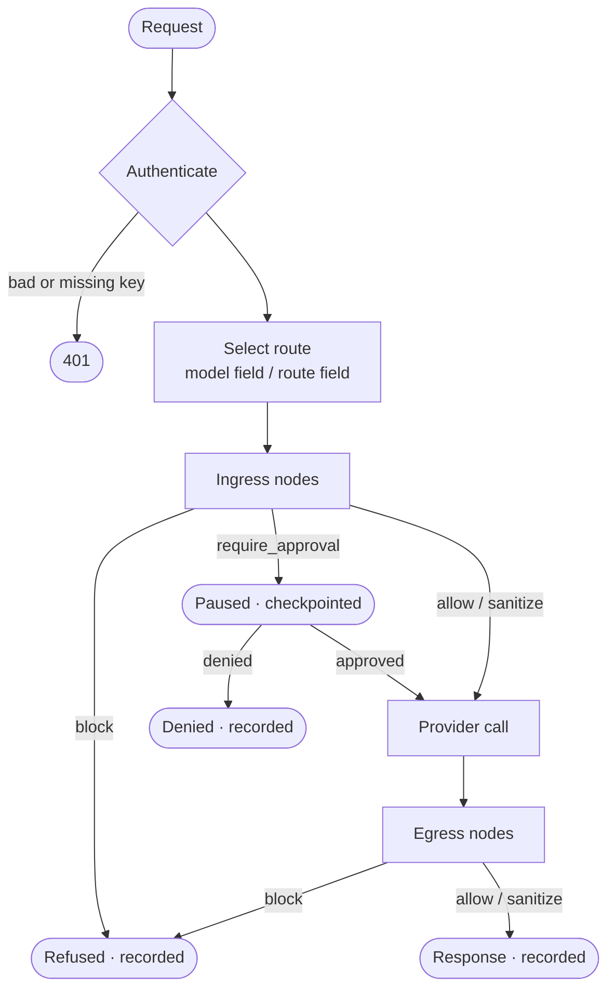
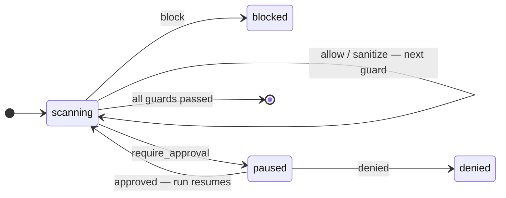

# Core concepts

Five ideas explain almost everything Aegis does: **routes**, **stages**,
**nodes and guardrails**, **verdicts**, and **`RunState`**.

## Request lifecycle



1. **Authenticate.** The `Authorization: Bearer aeg-…` key resolves to a
   principal (`/metrics` is the only unauthenticated path). With
   `--no-auth` every request is the anonymous principal.
2. **Select a route.** `/v1/runs` takes a `route` field;
   `/v1/chat/completions` uses the `model` field as the route name.
3. **Ingress.** The route's ingress nodes run in order against the request.
4. **Execute.** The route's provider is called with the (possibly masked)
   messages.
5. **Egress.** Egress nodes run against the response — e.g. PII unmasking.
6. **Record.** The run's status and full event log go to the run store;
   a hash-chained `run_evidence` record goes to the ledger.

## Routes

A route binds a **provider** to a **pipeline**. Each route is compiled once
at startup into its own LangGraph graph.

```yaml
providers:
  cheap:
    type: fake
  careful:
    type: fake

guardrails:
  pii:
    pack: aegis.pii
    mode: mask
  classify:
    pack: aegis.classification

pipeline:              # the default pipeline for every route…
  ingress: [pii]
  egress: [pii]

routes:
  default:
    provider: cheap
  sensitive:
    provider: careful
    pipeline:          # …unless the route declares its own
      ingress: [classify, pii]
      egress: [pii]
```

## Stages, nodes and guardrails

A guardrail entry in `aegis.yaml` names a **pack**. At startup the pack's
factory turns that entry into one or more **pipeline nodes**, each assigned
to a stage. That is why a single `pii` entry can place a mask node on
ingress *and* an unmask node on egress.

Two kinds of object end up in a stage:

| | Contract | Returns | Use it for |
|---|---|---|---|
| **Guardrail** | `async scan(state) -> Verdict` | a verdict | Yes/no/pause decisions: residency, budgets, injection checks |
| **Pipeline node** | `async run(state) -> RunStateDelta` | a partial state update | Transformations: masking, labelling, retrieval |

Guardrails are wrapped in a `GuardNode`, which runs its guards in order,
records one event per verdict, and stops at the first block or pause.

## Verdicts

Every guardrail returns exactly one verdict:

| Verdict | Constructor | Effect |
|---|---|---|
| <Verdict kind="allow" /> | `Verdict.allow()` | Continue unchanged. |
| <Verdict kind="sanitize" /> | `Verdict.sanitize(replacement)` | Continue, with message content replaced by `replacement`. |
| <Verdict kind="block" /> | `Verdict.block(reason)` | Stop. Run status `blocked`; the provider is never called if it happens on ingress. |
| <Verdict kind="require_approval" /> | `Verdict.require_approval(prompt)` | Checkpoint and pause. Run status `paused` until a reviewer resumes it. |



Every verdict — **including `allow`** — becomes an event in the run's log
and in the ledger, so "which guard let this through?" is answerable.

::: tip Targeted rewrites belong in nodes
`sanitize` replaces message content wholesale. For surgical edits (masking a
single entity, redacting a span) write a pipeline node that returns
rewritten `messages` in its `RunStateDelta` — that is how the PII pack works.
:::

## RunState

Nodes never import each other; they communicate only through `RunState`:

| Field | Purpose |
|---|---|
| `run_id`, `route`, `principal` | Identity of the run. |
| `messages` | The conversation, as the next node will see it. |
| `labels` | Free-form `dict[str, str]` for cross-pack signals — the classification pack writes `labels["classification"]`. |
| `mask_map` | Placeholder → original value. Never sent to the model. |
| `events` | Append-only audit log (`stage`, `node`, `event_type`, `data`). |
| `usage` | Token and cost accounting. |
| `response`, `status` | Output and one of `running`, `completed`, `blocked`, `paused`, `denied`. |

A node returns a `RunStateDelta`; `None` fields are left untouched and
`events` are appended.

## Run statuses

| Status | Meaning |
|---|---|
| `completed` | All stages passed; `response` is set. |
| `blocked` | A guardrail returned `block`. |
| `paused` | Waiting for a reviewer (`require_approval`). |
| `denied` | A reviewer denied a paused run. |
| `pending` / `running` | Background run not yet finished. |
| `error` | An exception escaped the pipeline. |

## Next

- [Human approvals](./approvals) — the `require_approval` path end to end.
- [Audit & evidence ledger](./audit) — where the events go.
- [Write a plugin](/develop/plugins) — add your own guardrail.
