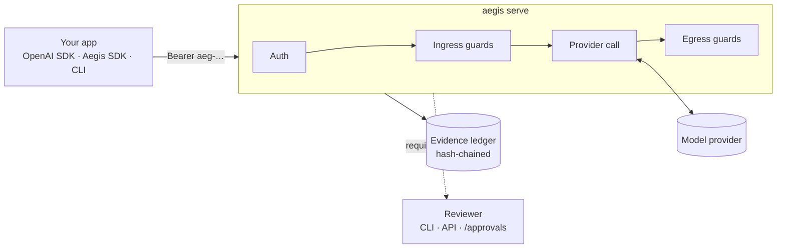

# Introduction

Aegis is a **self-hosted AI gateway**. It sits between your applications and
your model providers and runs every request through a pipeline of guardrails
you declare in `aegis.yaml`. Each guardrail returns one of four verdicts —
<Verdict kind="allow" />, <Verdict kind="sanitize" />, <Verdict kind="block" />
or <Verdict kind="require_approval" /> — and every verdict is recorded, so
"why was this blocked, masked or paused, and who signed off?" always has an
answer.

## What you get

| | |
|---|---|
| **OpenAI-compatible API** | `POST /v1/chat/completions` works with any OpenAI client. The `model` field selects an Aegis route. |
| **Native runs API** | `POST /v1/runs` with approver lists, background execution, and full event logs. |
| **Guardrail pipeline** | Ordered `ingress` and `egress` guard lists, per route or global. |
| **Human-in-the-loop** | `require_approval` checkpoints the run; a named principal resumes it. |
| **Evidence ledger** | Hash-chained, append-only SQLite ledger of route inventory and run evidence, verifiable offline. |
| **Policy packs** | PII masking (Presidio), residency, classification, budgets, LLM Guard. |
| **Plugin contracts** | Providers, guardrails, nodes, exporters, secret backends — discovered via Python entry points. |
| **Tooling** | `aegis` CLI, Python SDK, OpenAPI spec for generating clients in any language, contract test kits. |

## How the pieces fit

## Where things stand

Aegis is **alpha** software. The core request path is solid and tested;
some capabilities are available as Python APIs before they are reachable from
`aegis.yaml`. This table is the honest map:

| Capability | From `aegis.yaml` / `aegis serve` | From Python |
|---|---|---|
| Providers: `fake`, `anthropic` (via LiteLLM), `openai_compatible`, plugin types | ✅ | ✅ |
| `ingress` / `egress` guard stages, per-route overrides | ✅ | ✅ |
| Human approvals (SQLite checkpointer) | ✅ | ✅ — Postgres checkpointer too |
| Evidence ledger, `aegis explain`, audit export/verify | ✅ | ✅ |
| Forwarding evidence to other systems (`jsonl`, `webhook`, plugins) | ✅ | ✅ |
| API-key auth (`aeg-…` virtual keys) | ✅ | ✅ |
| Streaming (ingress always applied; true or buffered egress) | ✅ | ✅ |
| `tool_call` / `tool_result` stages | **Refused at startup** — not enforceable from YAML yet | ✅ `McpExecuteNode` |
| RAG retrieval into the pipeline | CLI index/query only | ✅ retrieval node + stores |
| Budget accounting (check on ingress, charge on egress) | ✅ | ✅ |
| Run store (`/v1/runs`, `/v1/audit`) — survives restarts | ✅ SQLite | ✅ pluggable `RunStore` |
| Secret backends | `env` | `env`, `keyring`, custom |

Wiring the refused stages and the CLI-only features into `aegis serve` are good
first contributions — see
[Contributing](/CONTRIBUTING).

## Next steps

- [Quickstart](./quickstart) — a governed endpoint in a minute, no API keys.
- [Core concepts](./concepts) — the pipeline, verdicts and `RunState`.
- [Codebase tour](/develop/codebase) — if you are here to hack on Aegis itself.
