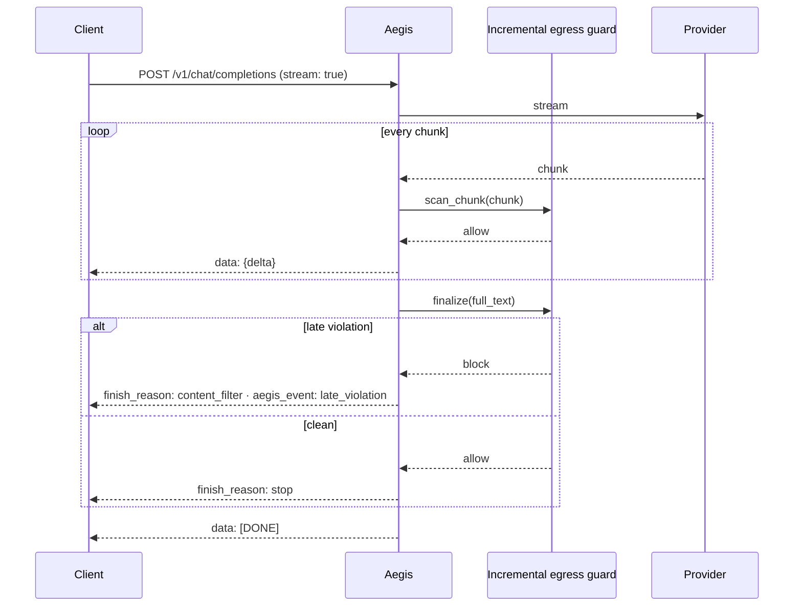

# Streaming

Egress guards want the whole response; streaming wants to forward tokens
immediately. Aegis resolves this **per route, at startup**, and never
silently: each route is either *true-streaming* or *buffered*, and the wire
format is valid OpenAI SSE either way.

## How a route's mode is chosen

Each guardrail declares `streaming = "none"` or `"incremental"`.

- **All egress guards incremental → true streaming.** Provider chunks are
  forwarded as they arrive, each one scanned with `scan_chunk()` first. When
  the provider finishes, every guard's `finalize()` sees the full text
  before the `stop` frame is sent.
- **Any egress guard `"none"` → buffered.** The whole pipeline runs, then the
  result is replayed as SSE frames. Clients see latency, never protocol
  errors.



A block from `scan_chunk()` ends the stream immediately with
`finish_reason: "content_filter"` and `aegis_event: "stream_violation"`.

## Find out which mode you got

```bash
aegis policy lint aegis.yaml
```

`AEG-POL-003` is reported for every egress guard that forces a route to
buffer. It is informational — buffering is a legitimate choice when a guard
needs full context.

## Writing an incremental guard

```python
from typing import ClassVar, Literal

from aegis_core.pipeline.state import RunState
from aegis_core.pipeline.verdict import Verdict


class NoCodenamesGuard:
    name = "no_codenames"
    streaming: ClassVar[Literal["none", "incremental"]] = "incremental"

    async def scan(self, state: RunState) -> Verdict:
        return await self.finalize(state.response or "")

    async def scan_chunk(self, chunk: str) -> Verdict:
        if "PROJECT-ORCA" in chunk:
            return Verdict.block("codename leaked")
        return Verdict.allow()

    async def finalize(self, accumulated: str) -> Verdict:
        # Catches a codename split across two chunks.
        if "PROJECT-ORCA" in accumulated:
            return Verdict.block("codename leaked")
        return Verdict.allow()
```

`scan()` is still required — buffered routes and non-streaming requests use
it.

## Known limitation

::: warning 2.0.0a0
On a true-streaming route, a `stream: true` request to
`/v1/chat/completions` currently goes straight to the provider: **ingress
nodes are not run**, and the run is not written to the run store or ledger.
Nodes that don't declare `stream_capability` (such as the PII pack's unmask
node) count as streaming-capable, so the default `aegis init` config is
affected. Until this is fixed, don't rely on ingress policy for streamed
requests — use `stream: false` or `POST /v1/runs` for governed traffic.
:::
