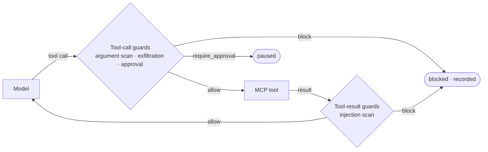

# Tool governance (MCP)

A tool call is model **output** — it can leak masked data or take a
dangerous action. A tool result is untrusted **input** — the classic
prompt-injection vector. Aegis guards both directions of the tool loop.



::: info Current state
The `tool_call` and `tool_result` stages are accepted and linted in
`aegis.yaml`, but `aegis serve` does not wire them yet. Tool governance is
available today as a Python API: an `McpExecuteNode` placed in the execute
position of a pipeline.
:::

## Guard contracts

Tool guards have their own small protocols in `aegis_core.mcp`:

```python
from typing import Any

from aegis_core.pipeline.state import RunState
from aegis_core.pipeline.verdict import Verdict


class NoProductionWrites:  # satisfies aegis_core.mcp.ToolCallGuard
    name = "no_prod_writes"

    async def scan_call(
        self, tool_name: str, arguments: dict[str, Any], state: RunState
    ) -> Verdict:
        if tool_name == "sql" and "prod" in str(arguments.get("database", "")):
            return Verdict.require_approval("SQL against production")
        return Verdict.allow()
```

A `ToolResultGuard` implements `scan_result(tool_name, result, state)`
instead. Two guards ship in the box:

| Guard | Position | What it does |
|---|---|---|
| `ExfiltrationGuard` | tool call | Blocks arguments containing any PII placeholder from the run's `mask_map`. |
| `ToolResultInjectionGuard` | tool result | Blocks results containing common instruction-hijack phrases. Pair with [LLM Guard](/packs/llm-guard) for model-based detection. |

## Wiring the governed tool loop

```python
from aegis_core.mcp import (
    ExfiltrationGuard,
    McpExecuteNode,
    ToolPolicy,
    ToolResultInjectionGuard,
)
from aegis_core.pipeline import PipelineExecutor


def register_agent_route(executor: PipelineExecutor, provider, session) -> None:
    """`session` is an initialised mcp.ClientSession; you own its lifecycle."""
    execute = McpExecuteNode(
        provider=provider,
        session=session,
        tool_call_guards=[ExfiltrationGuard()],
        tool_result_guards=[ToolResultInjectionGuard()],
        tool_policies={
            "send_email": ToolPolicy(name="send_email", require_approval=True)
        },
        max_iterations=10,
    )
    executor.register("agent", execute=execute)
```

The node lists the session's tools, calls the model, runs guards around
every tool call it makes, and loops until the model answers or
`max_iterations` is reached. Every guard verdict is written to the run's
events, so `aegis explain` shows tool decisions alongside ingress and
egress ones. A `ToolPolicy(require_approval=True)` pauses the run before
that tool executes, using the same [approval flow](./approvals).

## Exposing routes as MCP tools

`aegis_server.mcp.AegisMcpServer(executor)` wraps a `PipelineExecutor` in a
FastMCP server with one tool per route, named `route_<name>`, so agents that
speak MCP get governed completions. It is not mounted by `aegis serve`;
run it from your own process.

## Testing without a model

`FakeProvider(tool_calls_sequence=[[ToolCall(...)]])` returns the given tool
calls on successive completions, then `complete_response` — enough to drive
the whole loop in a unit test. See [Testing](/develop/testing).
