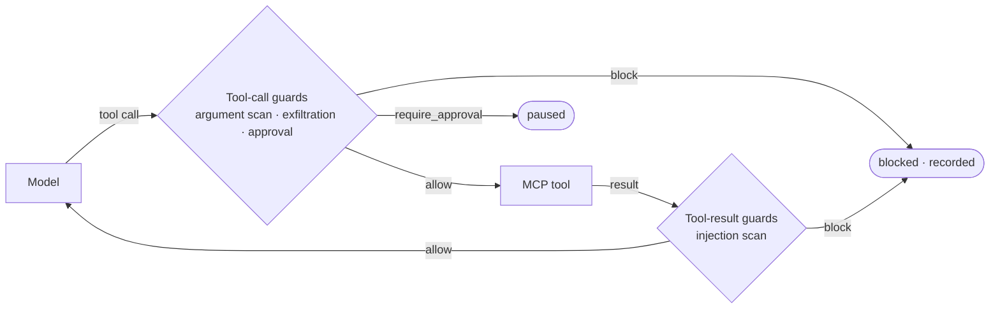

# Tool governance (MCP)

A tool call is model **output** — it can leak masked data or take a
dangerous action. A tool result is untrusted **input** — the classic
prompt-injection vector. Aegis guards both directions of the tool loop.


```mermaid
flowchart LR
    LLM[Model] -- tool call --> TCG{Tool-call guards<br/>argument scan · exfiltration · approval}
    TCG -- allow --> TOOL[MCP tool]
    TCG -- block --> STOP([blocked · recorded])
    TCG -- require_approval --> HOLD([paused])
    TOOL -- result --> TRG{Tool-result guards<br/>injection scan}
    TRG -- allow --> LLM
    TRG -- block --> STOP
```

## Tools in `aegis.yaml`

Declare a route's tools and their policies; `aegis serve` runs the governed
loop for that route.

```yaml
providers:
  agent_model:
    type: fake                      # or a real model that supports tool calls
    complete_response: "Summary sent."
    tool_calls:                     # fake only: what the model asks for, per turn
      - [{name: search, arguments: {query: refund policy}}]
      - [{name: send_email, arguments: {to: finance@example.com, body: "…"}}]

routes:
  agent:
    provider: agent_model
    tool_guards: [exfiltration, injection]
    tools:
      search:
        description: Search the knowledge base
        result: "Duplicate charges are refundable within 60 days."
      send_email:
        description: Send an email
        result: sent
        require_approval: true      # pause; approving runs the call
      delete_records:
        deny: true                  # any call blocks the run
```

What happens on this route:

1. `search` runs; its result passes the `injection` guard and goes back to the model.
2. `send_email` pauses the run. The approval shows the tool and its
   arguments, so a reviewer sees *where* the email goes. Approving runs the
   call and the run completes; denying ends it without calling the tool.
3. A result containing "ignore all previous instructions" would block the
   run before the model sees it.

A tool's `result` is fixed text — a stand-in for a tool server, the way the
`fake` provider stands in for a model — which is enough to configure, test
and demonstrate policies. To call real tools, wire an MCP session in Python
(below). The pipeline keys `tool_call` / `tool_result` are reserved: `aegis
serve` refuses to start if they're set (`AEG-POL-004`).

## Guard contracts

Tool guards have their own small protocols in `aegis_core.mcp`:

```python
from typing import Any

from aegis_core.pipeline.state import RunState
from aegis_core.pipeline.verdict import Verdict


class NoProductionWrites:  # satisfies aegis_core.mcp.ToolCallGuard
    name = "no_prod_writes"

    async def scan_call(
        self, tool_name: str, arguments: dict[str, Any], state: RunState
    ) -> Verdict:
        if tool_name == "sql" and "prod" in str(arguments.get("database", "")):
            return Verdict.require_approval("SQL against production")
        return Verdict.allow()
```

A `ToolResultGuard` implements `scan_result(tool_name, result, state)`
instead. Two guards ship in the box:

| Guard | Position | What it does |
|---|---|---|
| `ExfiltrationGuard` | tool call | Blocks arguments containing any PII placeholder from the run's `mask_map`. |
| `ToolResultInjectionGuard` | tool result | Blocks results containing common instruction-hijack phrases. Pair with [LLM Guard](/packs/llm-guard) for model-based detection. |

## Wiring the governed tool loop

```python
from aegis_core.mcp import (
    ExfiltrationGuard,
    McpExecuteNode,
    ToolPolicy,
    ToolResultInjectionGuard,
)
from aegis_core.pipeline import PipelineExecutor


def register_agent_route(executor: PipelineExecutor, provider, session) -> None:
    """`session` is an initialised mcp.ClientSession; you own its lifecycle."""
    execute = McpExecuteNode(
        provider=provider,
        session=session,
        tool_call_guards=[ExfiltrationGuard()],
        tool_result_guards=[ToolResultInjectionGuard()],
        tool_policies={
            "send_email": ToolPolicy(name="send_email", require_approval=True)
        },
        max_iterations=10,
    )
    executor.register("agent", execute=execute)
```

The node lists the session's tools, calls the model, runs guards around
every tool call it makes, and loops until the model answers or
`max_iterations` is reached. Every guard verdict is written to the run's
events, so `aegis explain` shows tool decisions alongside ingress and
egress ones. A `ToolPolicy(require_approval=True)` pauses the run before
that tool executes, using the same [approval flow](./approvals); approving
runs the call and continues the loop.

## Exposing routes as MCP tools

`aegis_server.mcp.AegisMcpServer(executor)` wraps a `PipelineExecutor` in a
FastMCP server with one tool per route, named `route_<name>`, so agents that
speak MCP get governed completions. It is not mounted by `aegis serve`;
run it from your own process.

## Testing without a model

`FakeProvider(tool_script=[[ToolCall(...)]])` requests the given tool calls,
one list per turn — chosen by how many tool results the conversation holds —
then returns `complete_response`. Because it depends only on the request, a
run that pauses for approval and is re-run gets the same answers.
`aegis_core.mcp.static.StaticToolSession` serves canned tool results, so the
whole loop runs without an MCP server. See [Testing](/develop/testing).
