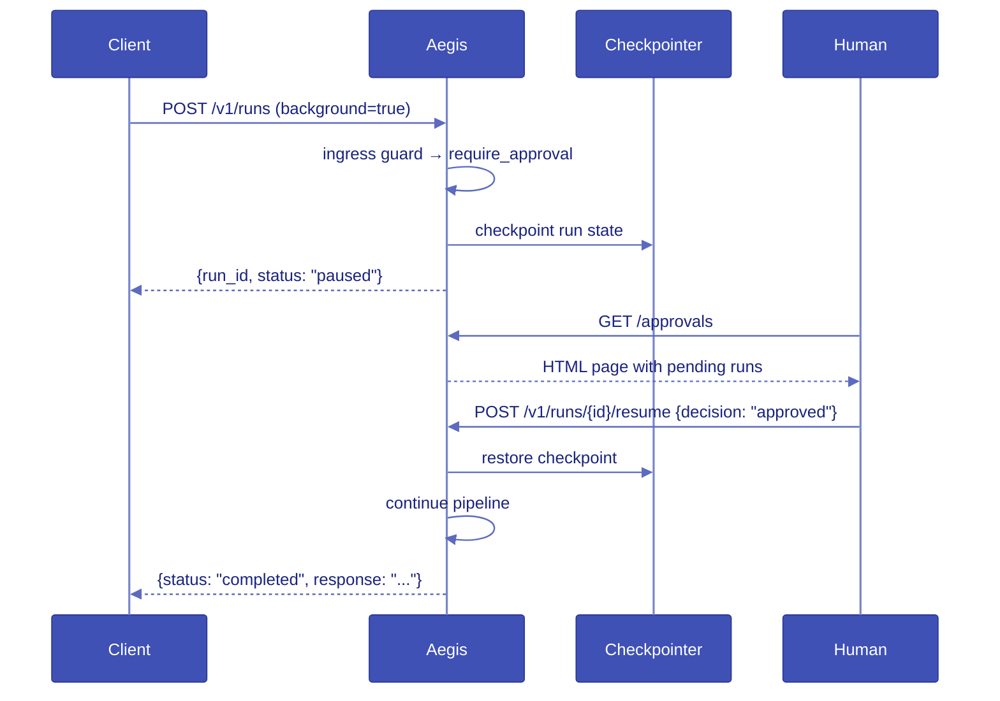

# How-to: HITL approvals

Human-in-the-loop (HITL) approval pauses a run at a guardrail that returns
`Verdict.require_approval()` and waits for a human decision before continuing.

## HITL sequence



## Configure a guardrail to require approval

```python
from aegis_core.pipeline import Verdict


class SensitiveTopicGuard:
    name = "sensitive-topic"
    streaming = "none"

    async def scan(self, messages, state):
        text = " ".join(m.get("content", "") for m in messages)
        if "financial advice" in text.lower():
            return Verdict.require_approval("Financial advice requires human review")
        return Verdict.allow()
```

## Enable a checkpointer

HITL requires a checkpointer. For development, SQLite is automatic when using
`aegis dev`. For production, configure Postgres:

```yaml
persistence:
  type: postgres
  url: secret://env/DATABASE_URL
```

## Approve or deny

**Via the Approvals UI** — open `http://localhost:8000/approvals` in a browser.
Pending runs are listed with approve and deny buttons.

**Via the CLI**:

```bash
aegis runs list --pending
aegis runs approve <run-id>
aegis runs deny <run-id>
```

**Via the API**:

```bash
curl -X POST http://localhost:8000/v1/runs/<run-id>/resume \
  -H "Content-Type: application/json" \
  -d '{"decision": "approved"}'
```

## Approver authority

Restrict which principals can approve a run by setting `approvers:` on the
run request:

```bash
curl -X POST http://localhost:8000/v1/runs \
  -H "Authorization: Bearer aeg-..." \
  -d '{"messages": [...], "approvers": ["user-id-1", "team-lead"]}'
```

A resume request from a principal not in `approvers` is rejected with
`AEG-AUTH-003`.

## Polling for status

```bash
# Poll until completed or paused
curl http://localhost:8000/v1/runs/<run-id>
# {"run_id": "...", "status": "completed", "response": "..."}
```

Statuses: `pending` → `running` → `completed | paused | blocked | error`
