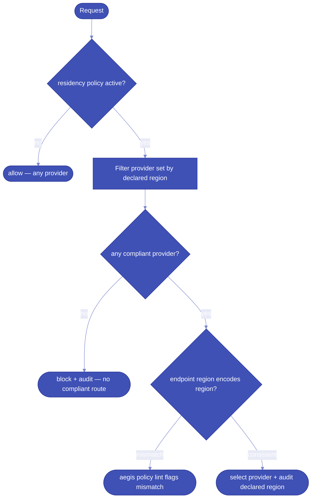

# How-to: Residency enforcement

The residency pack ensures that governed requests only reach providers
declared compliant for the required region. See the
[residency model explanation](../explanation/residency-model.md) for the
underlying design philosophy.

## Decision flow



## Configure

Declare residency on every provider profile:

```yaml
providers:
  eu_main:
    type: openai_compatible
    base_url: https://eu-west.api.example.com/v1
    api_key: secret://env/EU_API_KEY
    residency:
      region: eu-west
      jurisdiction: GDPR
      source_url: https://example.com/privacy/eu

routes:
  default:
    provider: eu_main
```

To activate fail-closed routing, add the residency pack to ingress:

```yaml
guardrails:
  residency:
    pack: aegis.residency

pipeline:
  ingress: [residency]
```

## Lint endpoint validation

```bash
aegis policy lint
```

For Azure OpenAI, Bedrock, Vertex, and OpenAI regional endpoints, Aegis
parses the declared region from the URL and flags any mismatch with the
`residency.region` field. This is the only verifiable signal — see the
[residency model](../explanation/residency-model.md) for why.

## Runtime audit

Every request records the declared region of the selected provider in the
audit log. Query with:

```bash
curl "http://localhost:8000/v1/audit?route=default"
```

## Network enforcement

Hard enforcement lives at the network layer. Pair the residency pack with
egress allowlisting at your gateway or DNS. Aegis enforces policy faithfully
inside the boundary it can see.
