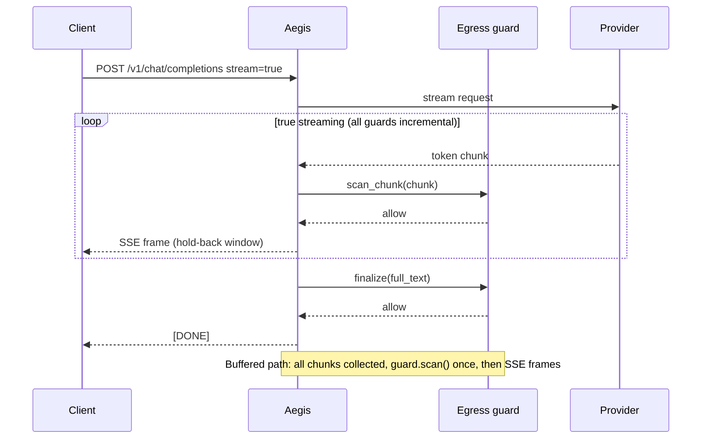

# How-to: Streaming modes

Aegis has two streaming modes: **true streaming** and **buffered**. The mode
is negotiated per route at compile time. See
[streaming negotiation](../explanation/streaming-negotiation.md) for the
design rationale.

## Streaming sequence



## True streaming

Requires **all** egress guards to implement `scan_chunk()` and `finalize()`:

```python
from typing import ClassVar, Literal

from aegis_core.guardrails import IncrementalGuardrail  # noqa: F401
from aegis_core.pipeline import Verdict


class MyIncrementalGuard:
    streaming: ClassVar[Literal["incremental"]] = "incremental"
    name = "my-incremental"

    async def scan_chunk(self, chunk: str, ctx) -> Verdict:
        # Quick per-chunk check
        return Verdict.allow()

    async def finalize(self, full_text: str, ctx) -> Verdict:
        # Full-text check after all chunks arrive
        if "forbidden" in full_text:
            return Verdict.block("Late violation detected")
        return Verdict.allow()

    async def scan(self, messages, state) -> Verdict:
        return Verdict.allow()
```

## Buffered mode

Any guard that only implements `scan()` (i.e., `streaming = "none"`) forces
the route to buffer. The client receives valid OpenAI SSE frames after the
guard pass completes — it perceives latency, never protocol errors.

## Checking the mode

```bash
aegis policy lint
```

Reports every route's streaming mode and flags any non-incremental guard that
causes a downgrade:

```
route 'default': buffered (toxicity_ml declares streaming=none)
```

## Late violations

In true streaming, if `finalize()` returns a block verdict, Aegis:

1. Truncates the stream immediately
2. Emits a `content_filter` finish event with `finish_reason: content_filter`
3. Records the violation in the audit log

Clients built on OpenAI SDKs receive a standard SSE termination and a
structured violation event.
