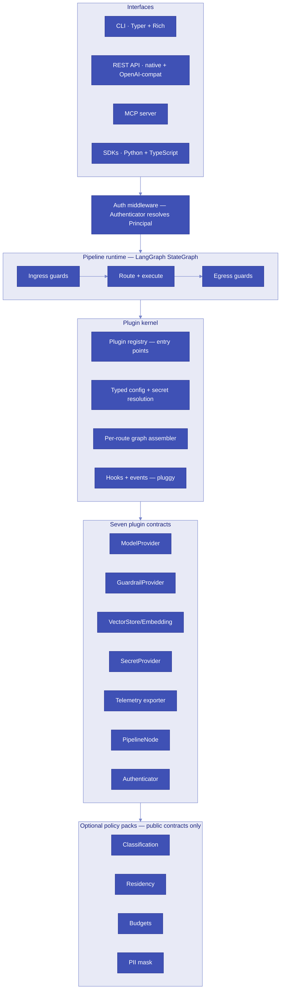

# Aegis AI Gateway

[](https://github.com/aegis-ai/aegis/actions/workflows/ci.yml)
[](https://e-choness.github.io/aegis/)
[](https://pypi.org/project/aegis-ai/)
[](https://pypi.org/project/aegis-ai/)
[](https://github.com/aegis-ai/aegis/blob/main/LICENSE)
[](https://github.com/aegis-ai/aegis)

An open-source, plugin-first AI gateway framework. A small kernel plus seven plugin contracts puts a governed, observable, provider-agnostic pipeline between applications and LLM providers. Every flagship feature — data classification, residency enforcement, PII masking, budgets — is built on the same public contracts third-party developers use. Self-hosted, CLI-first, single-tenant-by-design.

**Features:**

- Provider-agnostic: LiteLLM backend, any OpenAI-compatible endpoint, or your own `ModelProvider`
- Four-verdict guardrail system: allow, block, sanitize, require_approval
- Human-in-the-loop (HITL) with LangGraph checkpointed interrupts
- OpenAI-compatible `/v1/chat/completions` — drop-in for any OpenAI client
- True streaming with capability negotiation (buffered fallback, OpenAI SSE wire)
- MCP tool governance: pre- and post-call guards on every tool invocation
- RAG with governed context injection
- Policy packs: PII masking, classification, residency, budgets
- First-party Python + TypeScript SDKs

## Architecture



## Quick start

```bash
pip install aegis-ai
aegis init            # writes starter aegis.yaml
aegis dev             # localhost gateway, no auth, FakeProvider
```

Then point any OpenAI client at `http://localhost:8000/v1`:

```python
import openai

client = openai.OpenAI(base_url="http://localhost:8000/v1", api_key="demo")
response = client.chat.completions.create(
    model="default",
    messages=[{"role": "user", "content": "Hello, Aegis!"}],
)
print(response.choices[0].message.content)
```

See the [five-minute gateway tutorial](tutorials/five-minute-gateway.md) for a full walkthrough.

## Links

- [Examples gallery](https://github.com/aegis-ai/aegis/tree/main/examples)
- [Plugin authoring guide](tutorials/first-guardrail.md)
- [Contributing](CONTRIBUTING.md)
- [Security policy](SECURITY.md)
- [v1 legacy tag](https://github.com/aegis-ai/aegis/releases/tag/v1-legacy) — v1 users, start here
