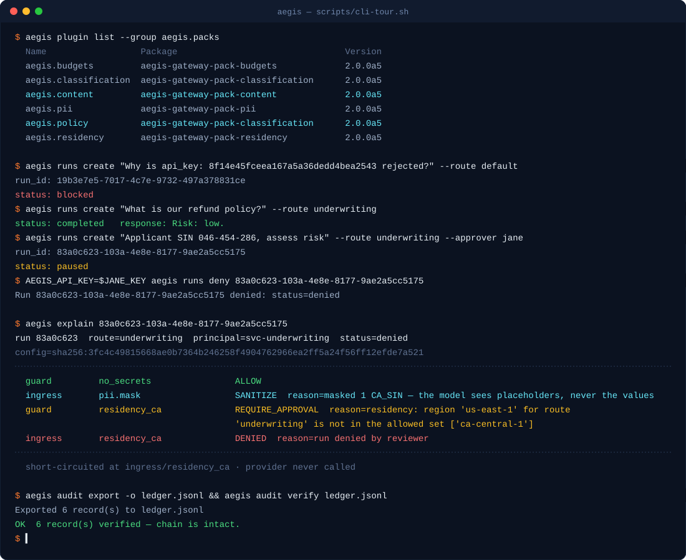

<div class="home-section">

## See it work

One config, one CLI. A prompt with an API key never reaches a model. A clean question to the loan-underwriting route — whose model runs in a US region — goes straight through; the same route with a Canadian SIN pauses for a named reviewer, who denies it. `aegis explain` shows why, and the exported ledger verifies offline.



**Try it in your browser:** the [live demo](https://huggingface.co/spaces/echoness/aegis-server) runs the real guardrails against a mock model — paste a prompt with an email address or a SIN, switch to the *underwriting* route, and approve or deny the paused run. Nothing to install.

Or run it yourself from a clone with `docker compose run --rm dev bash scripts/cli-tour.sh` — the config is [`examples/cli-tour.yaml`](https://github.com/e-choness/aegis/blob/main/examples/cli-tour.yaml).

## Sixty seconds to a governed endpoint

::: code-group

```bash [Install & run]
pip install aegis-gateway
aegis init                                 # writes aegis.yaml: fake provider + PII masking
aegis serve --config aegis.yaml --no-auth  # http://localhost:8000
```

```python [Call it (OpenAI SDK)]
from openai import OpenAI

client = OpenAI(base_url="http://localhost:8000/v1", api_key="dev")
reply = client.chat.completions.create(
    model="default",  # an Aegis route name
    messages=[{"role": "user", "content": "Email jane@example.com the summary"}],
)
print(reply.choices[0].message.content)
```

```bash [Call it (curl)]
curl -s http://localhost:8000/v1/chat/completions \
  -H "Content-Type: application/json" \
  -d '{"model":"default","messages":[{"role":"user","content":"Hello"}]}'
```

:::

</div>
