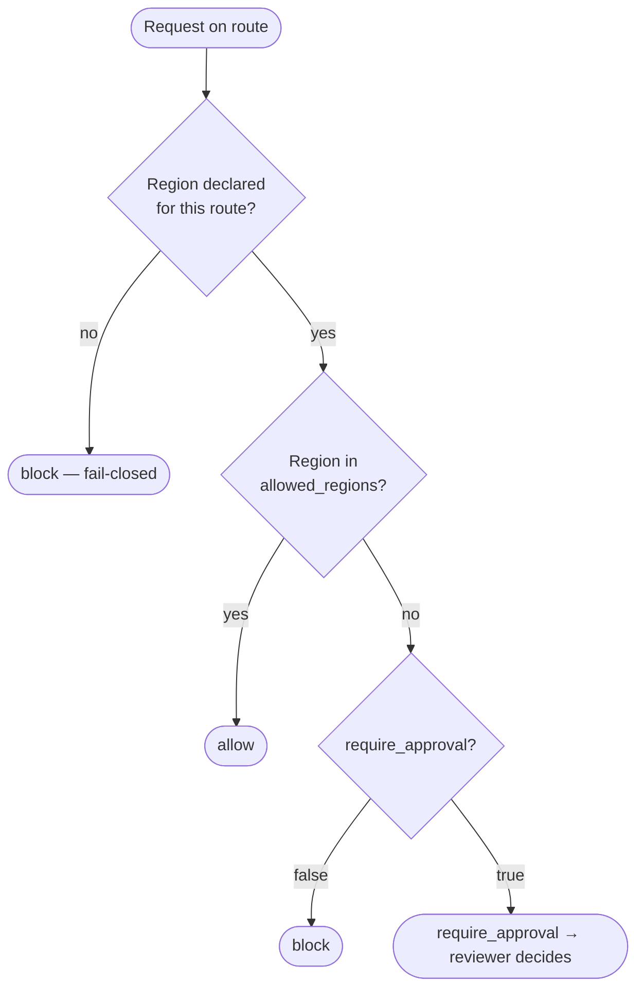

# Residency

`aegis.residency` enforces where a route's model endpoint is allowed to be.
It is **fail-closed**: an endpoint without a declared region is blocked, and
a declared region outside the allow-list is blocked or paused for approval.



## Configure

```yaml
providers:
  us_llm:
    type: openai_compatible
    base_url: https://api.example.com/v1
    model: example-large
    residency:                       # documentation of where the endpoint runs
      region: us-east-1
      jurisdiction: US
      source_url: https://example.com/trust/data-residency

guardrails:
  residency_ca:
    pack: aegis.residency
    region: us-east-1                # region of the endpoint this guard protects (required)
    jurisdiction: US                 # required
    allowed_regions: [ca-central-1]  # default: [region]
    require_approval: true           # default: false → block

pipeline:
  ingress: [residency_ca]

routes:
  underwriting:
    provider: us_llm
```

Region comparison is case-insensitive. The guard's `region` applies to every
route it is attached to — attach different residency guards via per-route
`pipeline:` blocks when routes use endpoints in different regions.

## What can and can't be verified

You cannot reliably detect where inference happens: geolocating an API
hostname finds an edge node, not the GPUs. Aegis enforces what is
**declared**, and checks what is **verifiable**:

- Some endpoints encode their region — Azure OpenAI
  (`<resource>.<region>.cognitiveservices.azure.com`), Bedrock
  (`bedrock-runtime.<region>.amazonaws.com`) and Vertex
  (`<region>-aiplatform.googleapis.com`). `aegis policy lint` compares a
  provider's `base_url` against its declared `residency.region` and reports
  a mismatch as `AEG-POL-005`.
- Every run's ledger record includes the config digest, so the declared
  regions in force for any request are provable after the fact.

Hard guarantees ("data never leaves Canada") belong at the network layer.
Pair this pack with egress allow-listing in your firewall or DNS.

