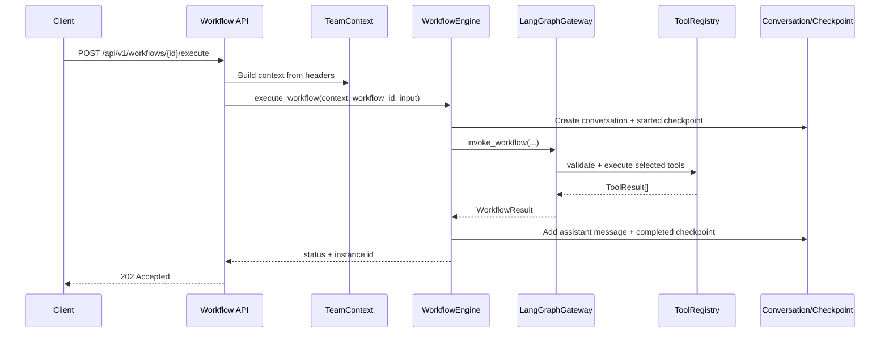

# Phase 2 Architecture

Phase 2 adds an agentic workflow layer on top of the Phase 1 inference gateway. The implementation keeps the existing inference, RAG, health, and admin endpoints intact, then adds workflow APIs, team context, tool validation, conversation state, checkpoints, and a queue foundation.

## Components

| Component | Path | Responsibility |
| --- | --- | --- |
| LangGraph gateway | `src/aegis/services/langgraph_gateway.py` | Registers workflow definitions and executes a three-node graph: select tools, execute tools, compose response. Uses LangGraph when available and falls back to the same deterministic node flow when it is not. |
| Workflow engine | `src/aegis/services/workflow_engine.py` | Owns workflow instances, status, conversation messages, checkpoints, queue submission, and metrics. |
| Team context | `src/aegis/services/team_context.py` | Builds request-scoped tenant identity from `X-Team-ID` and `X-User-ID`, then enforces membership, permissions, and budget checks. |
| Tool registry | `src/aegis/services/tool_registry.py` | Registers tools, validates schemas and team permissions, enforces timeout and budget checks, and records Prometheus metrics. |
| Built-in tools | `src/aegis/tools/` | Provides safe web search, constrained Python execution, read-only team data lookup, and team-scoped vector search. |
| Conversation storage | `src/aegis/services/conversation_storage.py` | Stores team-scoped conversation history and workflow state. |
| Checkpoints | `src/aegis/services/workflow_checkpoint.py` | Stores append-only state snapshots for restore and audit flows. |
| Queue foundation | `src/aegis/services/workflow_queue.py` | Stores priority queue items for RESTRICTED workflows and Phase 5 retry processing. |

## Request Flow



## Isolation Model

All Phase 2 API requests require `X-Team-ID` and `X-User-ID`. Unknown teams get a safe default context for local development; registered teams can restrict members, permissions, and budgets. Status, history, and conversation reads compare the stored `team_id` with the request context and return `404` for cross-team access.

Tools are filtered by team permission:

| Tool | Permission |
| --- | --- |
| `web_search` | `use_web_tools` |
| `database_query` | `use_data_tools` |
| `vector_search` | `use_data_tools` |
| `code_execute` | `use_code_execution` |

## Safety Boundaries

The web-search tool validates public URLs and rejects localhost, private IPs, link-local IPs, reserved ranges, and `.local` hosts.

The code execution tool allows Python only, blocks imports, `eval`, `exec`, `compile`, `open`, `input`, `__import__`, and common subprocess/system calls before running code in an isolated Python subprocess with a timeout and output truncation.

The database query tool accepts only `SELECT` statements and rejects cross-team `team_id` filters and mutating SQL keywords.

## Docker Verification

Phase 2 is tested through the Docker `test` service:

```bash
docker compose build test
docker compose --profile test run --rm test
```

No host-side package installation or local test execution is required.
