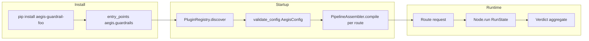

# Configuration reference

Aegis is configured via `aegis.yaml`. All fields are validated at startup via
pydantic v2 models. A schema change that breaks a config example breaks CI.

## Plugin lifecycle



## Top-level keys

All top-level keys are optional — omitted keys use defaults.

### `providers`

A map of named provider profiles.

```yaml
providers:
  my_provider:
    type: anthropic          # required: provider type
    api_key: secret://env/KEY  # optional: credential
    base_url: https://...    # optional: endpoint override
    model: claude-sonnet-4-5  # optional: default model
    residency:               # optional: residency metadata
      region: eu-west
      jurisdiction: GDPR
      source_url: https://provider.com/privacy
```

::: aegis_core.config.models.ProviderConfig
    options:
      show_source: false
      heading_level: 4

### `guardrails`

A map of named guardrail configurations.

```yaml
guardrails:
  pii:
    pack: aegis.pii          # required: dotted module path or pack name
    mode: mask               # optional: pack-specific option
  injection:
    pack: aegis.regex_guard
```

::: aegis_core.config.models.GuardrailConfig
    options:
      show_source: false
      heading_level: 4

### `pipeline`

Ordered node lists for each pipeline stage.

```yaml
pipeline:
  ingress: [pii, injection]    # run before model call
  tool_call: []                # run on model tool-call output
  tool_result: [injection]     # run on tool/RAG results
  egress: [pii.unmask]         # run on model response
```

::: aegis_core.config.models.PipelineConfig
    options:
      show_source: false
      heading_level: 4

### `routes`

A map of named route profiles.

```yaml title="aegis.yaml (partial)"
routes:
  default:
    provider: my_provider    # required: must reference a declared provider
    model: gpt-4o            # optional: model override
```

::: aegis_core.config.models.RouteConfig
    options:
      show_source: false
      heading_level: 4

### `auth`

Authentication mode.

```yaml
auth:
  type: api_key    # "none" (dev only) or "api_key"
```

::: aegis_core.config.models.AuthConfig
    options:
      show_source: false
      heading_level: 4

## Environment layering

Any config key can be overridden with an environment variable using double-underscore separators:

```bash
AEGIS__ROUTES__DEFAULT__MODEL=gpt-4o
AEGIS__AUTH__TYPE=api_key
```

This follows pydantic-settings conventions. Environment variables take
precedence over `aegis.yaml` values.

## Validation

Run `aegis config validate` to check your config before starting the server:

```bash
aegis config validate
# ✓ aegis.yaml is valid
```

Errors use `AEG-CFG-*` codes. See [error codes](errors.md) for the full table.
