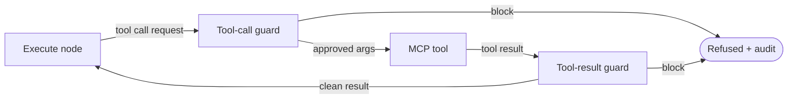

# Tutorial: Govern an MCP tool

This tutorial shows how to add governance to tool calls in an MCP-connected
pipeline — scanning arguments before the call and results after it.

## How tool governance works



The execute stage splices the guardrail contract into both directions:

- **Tool-call guard** — scans model output (arguments) before the tool runs.
  Catches masked-data exfiltration attempts and requires approval for
  high-risk tools.
- **Tool-result guard** — scans tool output before it re-enters the model
  context. The primary prompt-injection defence.

## Configure tool governance in `aegis.yaml`

```yaml
providers:
  main:
    type: anthropic
    api_key: secret://env/ANTHROPIC_API_KEY

guardrails:
  injection:
    pack: aegis.regex_guard
    mode: block

pipeline:
  tool_result: [injection]

routes:
  default:
    provider: main
```

The `tool_result` pipeline stage runs after every MCP tool result and after
every RAG retrieval — both are untrusted inputs.

## Per-tool require_approval

To pause and require human approval before a specific tool runs, add the tool
to a per-tool policy:

```yaml
pipeline:
  tool_call: [approval_gate]
```

When the model calls a tool governed by `require_approval`, the run pauses
via a LangGraph interrupt. A human approves or denies via the Approvals UI
(`/approvals`) or the CLI (`aegis runs approve <run-id>`).

## Testing tool governance

Use `FakeProvider` with `tool_calls_sequence` to inject synthetic tool calls
in unit tests — no real model or MCP server required:

```python
from aegis_core.testing import FakeProvider

provider = FakeProvider(
    tool_calls_sequence=[
        [
            {"name": "search", "arguments": {"query": "hello"}},
        ]
    ],
)
```

The tool-result guard will scan the result of each call. A blocked result
causes the run to end with `status="blocked"`.

## Next steps

- [HITL approvals](../how-to/hitl-approvals.md) — full human-in-the-loop flow
- [MCP server](../reference/rest-api.md) — expose Aegis routes as MCP tools
